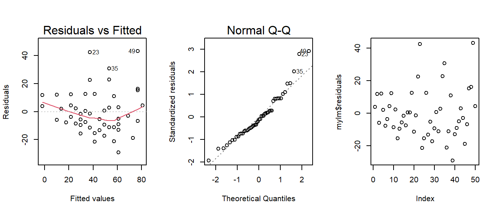
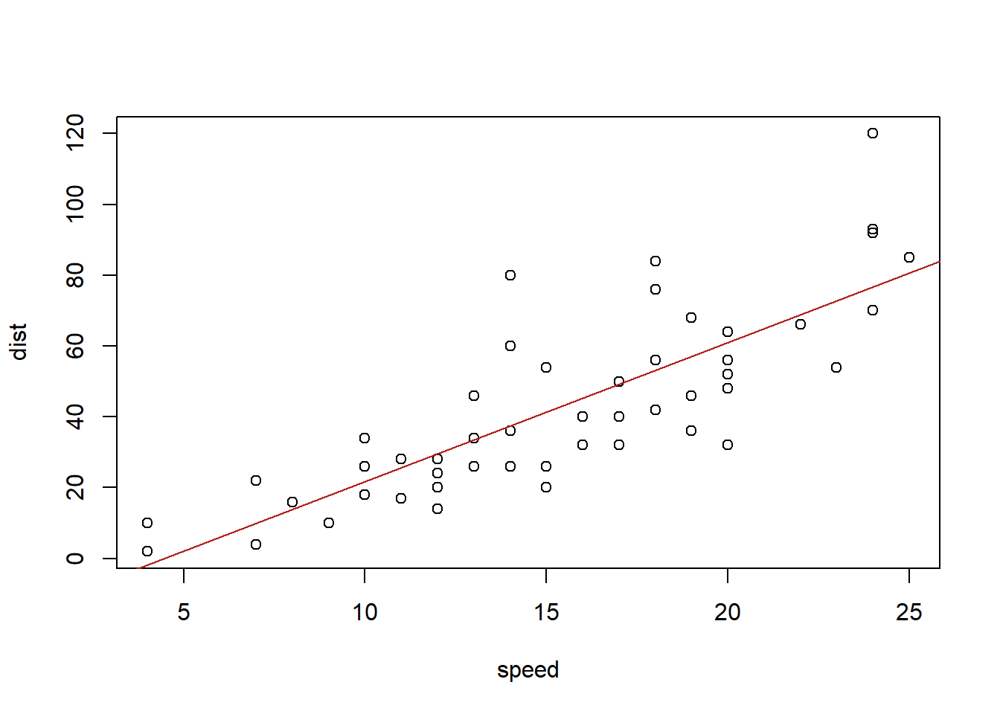
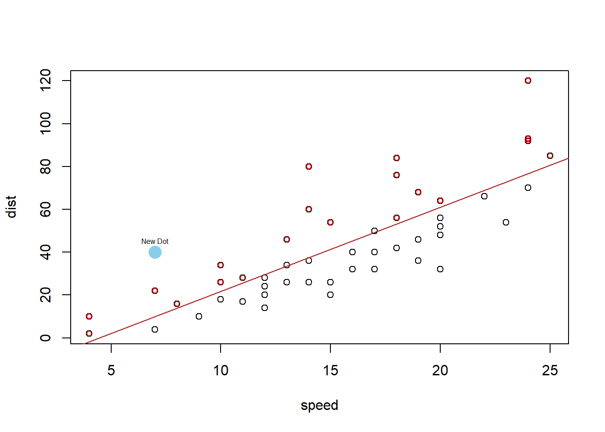
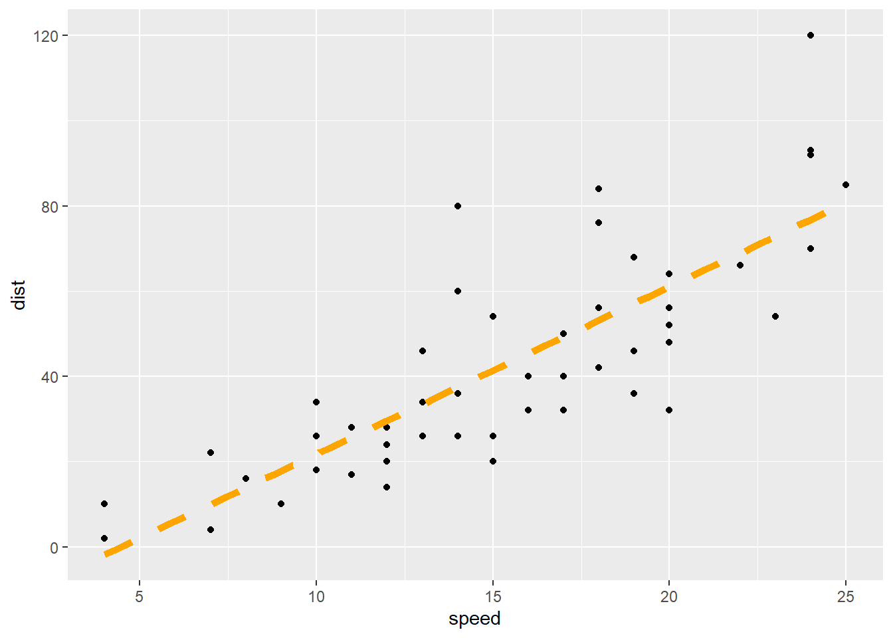
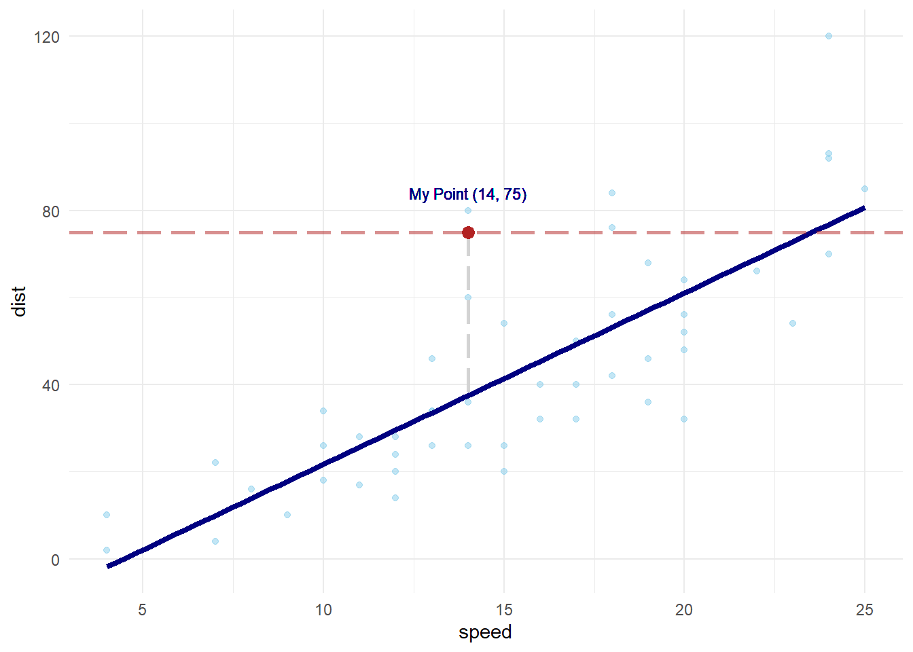
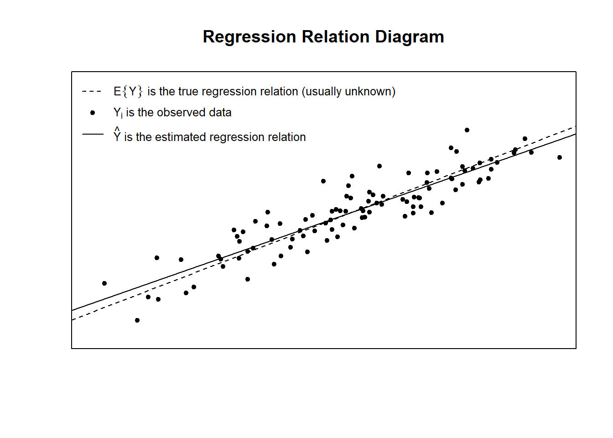
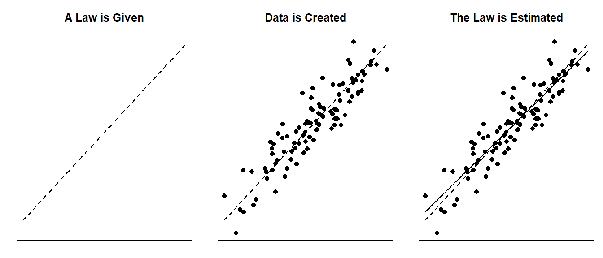
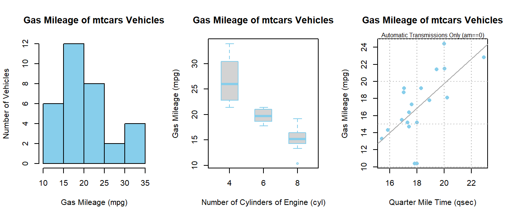
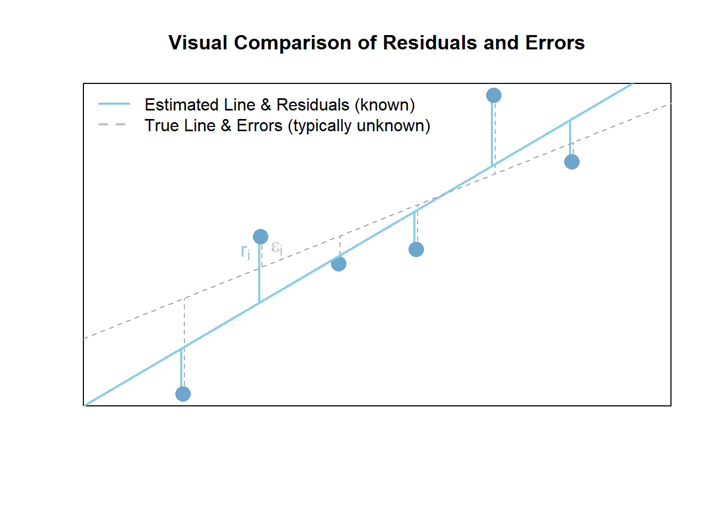
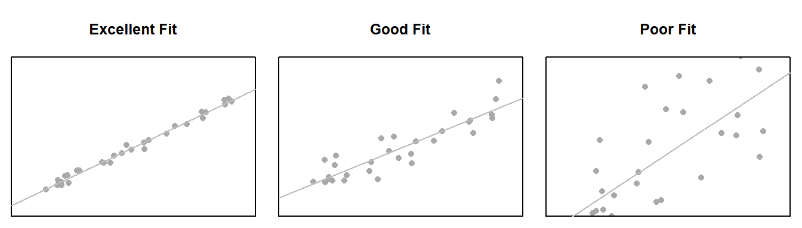

<script type="text/javascript">
 function showhide(id) {
    var e = document.getElementById(id);
    e.style.display = (e.style.display == 'block') ? 'none' : 'block';
 }
 
 function openTab(evt, tabName) {
    var i, tabcontent, tablinks;
    tabcontent = document.getElementsByClassName("tabcontent");
    for (i = 0; i < tabcontent.length; i++) {
        tabcontent[i].style.display = "none";
    }
    tablinks = document.getElementsByClassName("tablinks");
    for (i = 0; i < tablinks.length; i++) {
        tablinks[i].className = tablinks[i].className.replace(" active", "");
    }
    document.getElementById(tabName).style.display = "block";
    evt.currentTarget.className += " active";
 }
</script>


----

Determine which explanatory variables have a significant effect on the mean of the quantitative response variable.

----

## Simple Linear Regression {.tabset .tabset-fade .tabset-pills}

<div style="float:left;width:125px;" align=center>

</div>

Simple linear regression is a good analysis technique when the data consists of a single quantitative response variable $Y$ and a single quantitative explanatory variable $X$. 

### Overview {.tabset}

<div style="padding-left:125px;">

**Mathematical Model**

The true regression model assumed by a regression analysis is given by


<div style="float:right;font-size:.8em;background-color:lightgray;padding:5px;border-radius:4px;"><a style="color:darkgray;" href="javascript:showhide('simplelinearlatexrcode')">Math Code</a></div>


<div id="simplelinearlatexrcode" style="display:none;">
```{}
$$
  \underbrace{Y_i}_\text{Some Label} = \overbrace{\beta_0}^\text{y-int} + \overbrace{\beta_1}^\text{slope} \underbrace{X_i}_\text{Some Label} + \epsilon_i \quad \text{where} \ \epsilon_i \sim N(0, \sigma^2)
$$
```
</div>

<center>
<span class="tooltipr">
$Y_i$
  <span class="tooltiprtext">The response variable. The "i" denotes that this is the y-value for individual "i", where "i" is 1, 2, 3,... and so on up to $n$, the sample size.</span>
</span><span class="tooltipr">
$=$
  <span class="tooltiprtext">This states that we are assuming $Y_i$ was created, or is "equal to" the formula that will follow on the right-hand-side of the equation.</span>
</span><span class="tooltipr">
$\underbrace{\overbrace{\beta_0}^\text{y-intercept} + \overbrace{\beta_1}^\text{slope} X_i \ }_\text{true regression relation}$
  <span class="tooltiprtext">The true regression relation is a line, a line that is typically unknown in real life. It can be likened to "God's Law" or "Natural Law". Something that governs the way the data behaves, but is unkown to us.</span>
</span><span class="tooltipr">
$+$
  <span class="tooltiprtext">This plus sign emphasizes that the actual data, the $Y_i$, is created by adding together the value from the true line $\beta_0 + \beta_1 X_i$ and an individual error term $\epsilon_i$, which allows each dot in the regression to be off of the line by a certain amount called $\epsilon_i$.</span>
</span><span class="tooltipr">
$\overbrace{\epsilon_i}^\text{error term}$
  <span class="tooltiprtext">Error term for each individual $i$. The error terms are "random" and unique for each individual. This provides the statistical relationship of the regression. It is what allows each dot to be different, while still coming from the same line, or underlying law.</span>
</span><span class="tooltipr">
$\quad \text{where}$
  <span class="tooltiprtext">Some extra comments are needed about $\epsilon_i$...</span>
</span><span class="tooltipr">
$\ \overbrace{\epsilon_i \sim N(0, \sigma^2)}^\text{error term normally distributed}$
  <span class="tooltiprtext">The error terms $\epsilon_i$ are assumed to be normally distributed with constant variance. Pay special note that the $\sigma$ does not have an $i$ in it, so it is the same for each individual. In other words, the variance is constant. The mean of the errors is zero, which causes the dots to be spread out symmetrically both above and below the line.</span>
</span>
</center>

<br/>

The estimated regression line obtained from a regression analysis, pronounced "y-hat", is written as 


<div style="float:right;font-size:.8em;background-color:lightgray;padding:5px;border-radius:4px;"><a style="color:darkgray;" href="javascript:showhide('simplelinearlatexrcodeyhat')">Math Code</a></div>


<div id="simplelinearlatexrcodeyhat" style="display:none;">
```{}
$$
  \underbrace{\hat{Y}_i}_\text{Some Label} = \overbrace{b_0}^\text{est. y-int} + \overbrace{b_1}^\text{est. slope} \underbrace{X_i}_\text{Some Label}
$$
```
</div>

<center>
<span class="tooltipr">
$\hat{Y}_i$
  <span class="tooltiprtext">The estimated average y-value for individual $i$ is denoted by $\hat{Y}_i$. It is important to recognize that $Y_i$ is the actual value for individual $i$, and $\hat{Y}_i$ is the average y-value for all individuals with the same $X_i$ value.</span>
</span><span class="tooltipr">
$=$
  <span class="tooltiprtext">The formula for the average y-value, $\hat{Y}_i$ is equal to what follows...</span>
</span><span class="tooltipr">
$\underbrace{\overbrace{\ b_0 \ }^\text{y-intercept} + \overbrace{b_1}^\text{slope} X_i \ }_\text{estimated regression relation}$
  <span class="tooltiprtext">Two things are important to notice about this equation. First, it uses $b_0$ and $b_1$ instead of $\beta_0$ and $\beta_1$. This is because $b_0$ and $b_1$ are the estimated y-intercept and slope, respectively, not the true y-intercept $\beta_0$ and true slope $\beta_1$. Second, this equation does not include $\epsilon_i$. In other words, it is the estimated regression line, so it only describes the average y-values, not the actual y-values.</span>
</span>
</center>

<br/>

<div style="font-size:0.8em;">
Note: see the **Explanation** tab **The Mathematical Model** for details about these equations.
</div>


**Hypotheses**

<div style="float:right;font-size:.8em;background-color:lightgray;padding:5px;border-radius:4px;"><a style="color:darkgray;" href="javascript:showhide('simplelinearhypecodeslope')">Math Code</a></div>


<div id="simplelinearhypecodeslope" style="display:none;">

```{}
$$
\left.\begin{array}{ll}
H_0: \beta_1 = 0 \\  
H_a: \beta_1 \neq 0
\end{array}
\right\} \ \text{Slope Hypotheses}
$$

$$
\left.\begin{array}{ll}
H_0: \beta_0 = 0 \\  
H_a: \beta_0 \neq 0
\end{array}
\right\} \ \text{Intercept Hypotheses}
$$
```

</div>

<div style="clear:right;"></div>


$$
\left.\begin{array}{ll}
H_0: \beta_1 = 0 \\  
H_a: \beta_1 \neq 0
\end{array}
\right\} \ \text{Slope Hypotheses}^{\quad \text{(most common)}}\quad\quad
$$


$$
\left.\begin{array}{ll}
H_0: \beta_0 = 0 \\  
H_a: \beta_0 \neq 0
\end{array}
\right\} \ \text{Intercept Hypotheses}^{\quad\text{(sometimes useful)}}
$$

<br/>

If $\beta_1 = 0$, then the model reduces to $Y_i = \beta_0 + \epsilon_i$, which is a flat line. This means $X$ does not improve our understanding of the mean of $Y$ if the null hypothesis is true.


If $\beta_0 = 0$, then the model reduces to $Y_i = \beta_1 X + \epsilon_i$, a line going through the origin. This means the average $Y$-value is $0$ when $X=0$ if the null hypothesis is true.

**Assumptions** 

This regression model is appropriate for the data when five assumptions can be made.

1. **Linear Relation**: the true regression relation between $Y$ and $X$ is linear.
    
2. **Normal Errors**: the error terms $\epsilon_i$ are normally distributed with a mean of zero.

3. **Constant Variance**: the variance $\sigma^2$ of the error terms is constant (the same) over all $X_i$ values.

4. **Fixed X**: the $X_i$ values can be considered fixed and measured without error.

5. **Independent Errors**: the error terms $\epsilon_i$ are independent.

<div style="font-size:0.8em;">
Note: see the **Explanation** tab **Residual Plots & Regression Assumptions** for details about checking the regression assumptions.
</div>

**Interpretation**

The slope is interpreted as, "the change in the average y-value for a one unit change in the x-value." It **is not** the average change in y. **It is** the change in the average y-value.

The y-intercept is interpreted as, "the average y-value when x is zero." It is often not meaningful, but is sometimes useful. It just depends if x being zero is meaningful or not within the context of your analysis. For example, knowing the average price of a car with zero miles is useful. However, pretending to know the average height of adult males that weigh zero pounds, is not useful.


----

</div>


### R Instructions

<div style="padding-left:125px;">
**Console** Help Command: `?lm()`

**Perform the Regression**

<a href="javascript:showhide('simplelinearrcode')">
<div class="hoverchunk">
<span class="tooltipr">
mylm
  <span class="tooltiprtext">This is some name you come up with that will become the R object that stores the results of your linear regression `lm(...)` command.</span>
</span><span class="tooltipr">
&nbsp;<-&nbsp;
  <span class="tooltiprtext">This is the "left arrow" assignment operator that stores the results of your `lm()` code into `mylm` name.</span>
</span><span class="tooltipr">
lm(
  <span class="tooltiprtext">lm(...) is an R function that stands for "Linear Model". It performs a linear regression analysis for Y ~ X.</span>
</span><span class="tooltipr">
Y&nbsp;
  <span class="tooltiprtext">Y is your quantitative response variable. It is the name of one of the columns in your data set.</span>
</span><span class="tooltipr">
~&nbsp;
  <span class="tooltiprtext">The tilde symbol ~ is used to tell R that Y should be treated as the response variable that is being explained by the explanatory variable X.</span>
</span><span class="tooltipr">
X,
  <span class="tooltiprtext">X is the quantitative explanatory variable (at least it is typically quantitative but could be qualitative) that will be used to explain the average Y-value.</span>
</span><span class="tooltipr">
&nbsp;data = NameOfYourDataset 
  <span class="tooltiprtext">NameOfYourDataset is the name of the dataset that contains Y and X. In other words, one column of your dataset would be your response variable Y and another column would be your explanatory variable X.</span>
</span><span class="tooltipr">
)
  <span class="tooltiprtext">Closing parenthesis for the lm(...) function.</span>
</span><br/><span class="tooltipr">
summary(mylm)
  <span class="tooltiprtext">The `summary` command allows you to print the results of your linear regression that were previously saved in `mylm` name.</span>
</span><span class="tooltipr" style="float:right;font-size:.8em;">
&nbsp;Click to Show Output&nbsp; 
  <span class="tooltiprtext">Click to View Output.</span>
</span>
</div>
</a>

<div id="simplelinearrcode" style="display:none;">

Example output from a regression. Hover each piece to learn more.

<table class="rconsole">
<tr>
<td>
<span class="tooltiprout">
  Call:<br/>
  lm(formula = dist ~ speed, data = cars)
    <span class="tooltiprouttext">This is simply a statement of your original lm(...) "call" that you made when performing your regression. It allows you to verify that you ran what you thought you ran in the lm(...).</span>
</span>
</td>
</tr>
</table>
      

<br/>

<table class="rconsole">
<tr>
<td colspan="2">
  <span class="tooltiprout">
    Residuals:
      <span class="tooltiprouttext">Residuals are the vertical difference between each point and the line, $Y_i - \hat{Y}_i$. The residuals are supposed to be normally distributed, so a quick glance at their five-number summary can give us insight about any skew present in the residuals.
  </span>
</td>
</tr>
<tr>
<td align="right">
  <span class="tooltiprout">
    min<br/>
    &nbsp; -29.069
      <span class="tooltiprouttext">"min" gives the value of the residual that is furthest below the regression line. Ideally, the magnitude of this value would be about equal to the magnitude of the largest positive residual (the max) because the hope is that the residuals are normally distributed around the line.</span>
  </span>
</td><td align="right">   
  <span class="tooltiprout">
    1Q<br/>
    &nbsp; -9.525
      <span class="tooltiprouttext">"1Q" gives the first quartile of the residuals, which will always be negative, and ideally would be about equal in magnitude to the third quartile.</span>
  </span>
</td><td align="right"> 
  <span class="tooltiprout">
    Median<br/>
    &nbsp; -2.272
      <span class="tooltiprouttext">"Median" gives the median of the residuals, which would ideally would be about equal to zero. Note that because the regression line is the least squares line, the mean of the residuals will ALWAYS be zero, so it is never included in the output summary. This particular median value of -2.272 is a little smaller than zero than we would hope for and suggests a right skew in the data because the mean (0) is greater than the median (-2.272) witnessing the residuals are right skewed. This can also be seen in the maximum being much larger in magnitude than the minimum.</span>
  </span>
</td><td align="right">
  <span class="tooltiprout">
    3Q<br/>
    &nbsp; 9.215
      <span class="tooltiprouttext">"3Q" gives the third quartile of the residuals, which would ideally would be about equal in magnitude to the first quartile. In this case, it is pretty close, which helps us see that the first quartile of residuals on either side of the line is behaving fairly normally.</span>
  </span>
</td><td align="right">
  <span class="tooltiprout">
    Max</br>
    &nbsp; 43.201
      <span class="tooltiprouttext">"Max" gives the maximum positive residuals, which would ideally would be about equal in magnitude to the minimum residual. In this case, it is much larger than the minimum, which helps us see that the residuals are likely right skewed.</span>
  </span>
</td>
</tr>
</table>

<br/>


<table class="rconsole">
<tr>
<td colspan="2">
  <span class="tooltiprout">
    Coefficients:
      <span class="tooltiprouttext">Notice that in your lm(...) you used only $Y$ and $X$. You did type out any coefficients, i.e., the $\beta_0$ or $\beta_1$ of the regression model. These coefficients are estimated by the lm(...) function and displayed in this part of the output along with standard errors, t-values, and p-values.</span>
  </span>
</td>
</tr><tr>
<td align="left"></td>
<td align="right">
  <span class="tooltiprout">
    &nbsp; Estimate
      <span class="tooltiprouttext">To learn more about the "Estimates" of the "Coefficients" see the "Explanation" tab, "Estimating the Model Parameters" section for details.</span>
</td><td align="right">
  <span class="tooltiprout">
    &nbsp; Std. Error
      <span class="tooltiprouttext">To learn more about the "Standard Errors" of the "Coefficients" see the "Explanation" tab, "Inference for the Model Parameters" section.</span>
  </span>    
</td><td align="right">
  <span class="tooltiprout">
    &nbsp; t value 
      <span class="tooltiprouttext">To learn more about the "t value" of the "Coefficients" see the "Explanation" tab, "Inference for the Model Parameters" section.</span>
  </span>
</td><td align="right">
  <span class="tooltiprout">
    &nbsp; Pr(>|t|)
      <span class="tooltiprouttext">The "Pr" stands for "Probability" and the "(> |t|)" stands for "more extreme than the observed t-value". Thus, this is the p-value for the hypothesis test of each coefficient being zero.<br/> To learn more about the "p-value" of the "Coefficients" see the "Explanation" tab, "Inference for the Model Parameters" section. </span>
  </span>
</td>
</tr><tr>
<td align="left">
  <span class="tooltiprout">
    (Intercept)
      <span class="tooltiprouttext">This always says "Intercept" for any lm(...) you run in R. That is because R always assumes there is a y-intercept for your regression function.</span>
  </span>
</td><td align="right">
  <span class="tooltiprout">
    &nbsp; -17.5791
      <span class="tooltiprouttext">This is the estimate of the y-intercept, $\beta_0$. It is called $b_0$. It is the average y-value when X is zero.</span>
  </span>
</td><td align="right">
  <span class="tooltiprout">
    &nbsp; 6.7584
      <span class="tooltiprouttext">This is the standard error of $b_0$. It tells you how much $b_0$ varies from sample to sample. The closer to zero, the better.</span>
  </span>
</td><td align="right">
  <span class="tooltiprout">
    -2.601
      <span class="tooltiprouttext">This is the test statistic t for the test of $\beta_0 = 0$. It is calculated by dividing the "Estimate" of the intercept (-17.5791) by its standard error (6.7584). It gives the "number of standard errors" away from zero that the "estimate" has landed. In this case, the estimate of -17.5791 is -2.601 standard errors (6.7584) from zero, which is a fairly surprising distance as shown by the p-value.</span>
  </span>
</td><td align="right">
  <span class="tooltiprout">
    0.0123
      <span class="tooltiprouttext">This is the p-value of the test of the hypothesis that $\beta_0 = 0$. It measures the probability of observing a t-value as extreme as the one observed. To compute it yourself in R, use `pt(-abs(your t-value), df of your regression)*2`.</span>
  </span>
</td><td align="left">
  <span class="tooltiprout">
    *
      <span class="tooltiprouttext">This is called a "star". One star means significant at the 0.1 level of $\alpha$.</span>
  </span>
</td>
</tr><tr>
<td align="left">
  <span class="tooltiprout">
    speed
      <span class="tooltiprouttext">This is always the name of your X-variable in your lm(Y ~ X, ...).</span>
  </span>
</td><td align="right">
  <span class="tooltiprout">
    &nbsp; 3.9324
      <span class="tooltiprouttext">This is the estimate of the slope, $\beta_1$. It is called $b_1$. It is the change in the average y-value as X is increased by 1 unit.</span>
  </span>
</td><td align="right">
  <span class="tooltiprout">
    &nbsp; 0.4155
      <span class="tooltiprouttext">This is the standard error of $b_1$. It tells you how much $b_1$ varies from sample to sample. The closer to zero, the better.</span>
  </span>
</td><td align="right">
  <span class="tooltiprout">
    9.464
      <span class="tooltiprouttext">This is the test statistic t for the test of $\beta_1 = 0$. It is calculated by dividing the "Estimate" of the slope (3.9324) by its standard error (0.4155). It gives the "number of standard errors" away from zero that the "estimate" has landed. In this case, the estimate of 3.9324 is 9.464 standard errors (0.4155) from zero, which is a really surprising distance as shown by the smallness of the p-value.</span>
  </span>
</td><td align="right">
  <span class="tooltiprout">
    1.49e-12
      <span class="tooltiprouttext">This is the p-value of the test of the hypothesis that $\beta_1 = 0$. To compute it yourself in R, use `pt(-abs(your t-value), df of your regression)*2`</span>
  </span>
</td><td align="left">
<span class="tooltiprout">
    \*\*\*
      <span class="tooltiprouttext">This is called a "star". Three stars means significant at the 0.01 level of $\alpha$.</span>
  </span>
</td>
</tr>
</table>

<table class="rconsole">
<tr>
<td>
  <span>
  \-\-\-
  </span>
</td>
</tr>
</table>

<table class="rconsole">
<tr>
<td>
  <span class="tooltiprout">
    Signif. codes:  0 ‘\*\*\*’ 0.001 ‘\*\*’ 0.01 ‘*’ 0.05 ‘.’ 0.1 ‘ ’ 1
      <span class="tooltiprouttext">These "codes" explain what significance level the p-value is smaller than based on how many "stars" * the p-value is labeled with in the Coefficients table above.</span>
  </span>
</td>
</tr>
</table>

<br/>

<table class="rconsole">
<tr>
<td>
  <span class="tooltiprout">
    Residual standard error:
      <span class="tooltiprouttext">This is the estimate of $\sigma$ in the regression model $Y_i = \beta_0 + \beta_1 X_i + \epsilon_i$ where $\epsilon_i \sim N(0,\sigma^2)$. It is the square root of the MSE.</span>
  </span>
</td><td align="right">
  <span class="tooltiprout">
    &nbsp;15.38
      <span class="tooltiprouttext">For this particular regression, the estimate of $\sigma$ is 15.38. Squaring this number gives you the MSE, which is the estimate of $\sigma^2$.</span>
  </span>    
</td><td align="right">
  <span class="tooltiprout">
    &nbsp;on 48 degrees of freedom 
      <span class="tooltiprouttext">This is $n-p$ where $n$ is the sample size and $p$ is the number of parameters in the regression model. In this case, there is a sample size of 50 and two parameters, $\beta_0$ and $\beta_1$, so 50-2 = 48.</span>
  </span> 
</td> 
</tr>
</table>

<table class="rconsole">
<tr>
<td>
  <span class="tooltiprout">
    Multiple R-squared:
      <span class="tooltiprouttext">This is $R^2$, the percentage of variation in $Y$ that is explained by the regression model. It is equal to the SSR/SSTO or, equivalently, 1 - SSE/SSTO.</span>
  </span>
</td><td align="right">
  <span class="tooltiprout">
    &nbsp;0.6511,
      <span class="tooltiprouttext">In this particular regression, 65.11% of the variation in stopping distance `dist` is explained by the regression model using speed of the car.</span>
  </span>    
</td><td align="right">
  <span class="tooltiprout">
    &nbsp;Adjusted R-squared:
      <span class="tooltiprouttext">The adjusted R-squared will always be at least slightly smaller than $R^2$. The closer to R-squared that it is, the better. When it differs dramatically from $R^2$, it is a sign that the regression model is over-fitting the data.</span>
  </span> 
</td><td align="right">
  <span class="tooltiprout">
    &nbsp;0.6438
      <span class="tooltiprouttext">In this case, the value of 0.6438 is quite close to the original $R^2$ value, so there is no fear of over-fitting with this particular model. That is good.</span>
  </span>   
</td> 
</tr>
</table>

<table class="rconsole">
<tr>
<td>
  <span class="tooltiprout">
    F-statistic:
      <span class="tooltiprouttext">The F-statistic is found as the ratio of the MSR/MSP where MSR = SSR/(p-1) and MSE = SSE/(n-p) where n is the sample size and p is the number of parameters in the regression model.</span>
  </span>
</td><td align="right">
  <span class="tooltiprout">
    &nbsp;89.57
      <span class="tooltiprouttext">This is the value of the F-statistic for the lm(dist ~ speed, data=cars) regression. Note that SSE = sum( cars.lm\$res^2 ) = 11353.52 with n - p = 50 - 2 = 48 degrees of freedom for this data. Further, SSR = sum( (cars.lm\$fit - mean(cars$dist))^2 ) = 21185.46 with p - 1 = 1 degree of freedom. So MSR = 21185.46 and MSE = 11353.52 / 48 = 236.5317. So MSR / MSE = 21185.46 / 236.5317 = 89.56711.</span>
  </span>    
</td><td align="right">
  <span class="tooltiprout">
    &nbsp;on 1 and 48 DF, 
      <span class="tooltiprouttext">The 1 degree of freedom is the SSR degrees of freedom (p-1). The 48 is the SSE degrees of freedom (n-p).</span>
  </span> 
</td><td align="right">
  <span class="tooltiprout">
    &nbsp;p-value: 1.49e-12 
      <span class="tooltiprouttext">The p-value for an F-statistic is found by the code pf(89.56711, 1, 48, lower.tail=FALSE), which gives the probability of being more extreme than the observed F-statistic in an F distribution with 1 and 48 degrees of freedom.</span>
  </span>
</td>
</tr>
</table>


</div>

<br/>


**Check Assumptions 1, 2, 3, and 5**

<a href="javascript:showhide('assumptionplots')">
<div class="hoverchunk"><span class="tooltipr">
par(
  <span class="tooltiprtext">The par(...) command stands for "Graphical PARameters". It allows you to control various aspects of graphics in Base R.</span>
</span><span class="tooltipr">
mfrow=
  <span class="tooltiprtext">This stands for "multiple frames filled by row", which means, put lots of plots on the same row, starting with the plot on the left, then working towards the right as more plots are created.</span>
</span><span class="tooltipr">
c(
  <span class="tooltiprtext">The combine function c(...) is used to specify how many rows and columns of graphics should be placed together.</span>
</span><span class="tooltipr">
1,
  <span class="tooltiprtext">This specifies that 1 row of graphics should be produced.</span>
</span><span class="tooltipr">
3
  <span class="tooltiprtext">This states that 3 columns of graphics should be produced.</span>
</span><span class="tooltipr">
)
  <span class="tooltiprtext">Closing parenthesis for c(...) function.</span>
</span><span class="tooltipr">
)
  <span class="tooltiprtext">Closing parenthesis for par(...) function.</span>
</span><br/><span class="tooltipr">
plot(
  <span class="tooltiprtext">This version of plot(...) will actually create several regression diagnostic plots by default.</span>
</span><span class="tooltipr">
mylm,
  <span class="tooltiprtext">This is the name of an lm object that you created previously.</span>
</span><span class="tooltipr">
which=
  <span class="tooltiprtext">This allows you to select "which" regression diagnostic plots should be drawn.</span>
</span><span class="tooltipr">
1
  <span class="tooltiprtext">Selecting 1, would give the residuals vs. fitted values plot only.</span>
</span><span class="tooltipr">
:
  <span class="tooltiprtext">The colon allows you to select more than just one plot.</span>
</span><span class="tooltipr">
2
  <span class="tooltiprtext">Selecting 2 also gives the Q-Q Plot of residuals. If you wanted to instead you could just use which=1 to get the residuals vs fitted values plot, then you could use qqPlot(mylm\$residuals) to create a fancier Q-Q Plot of the residuals.</span>
</span><span class="tooltipr">
)
  <span class="tooltiprtext">Closing parenthesis for plot(...) function.</span>
</span><br/><span class="tooltipr">
plot(
  <span class="tooltiprtext">This version of plot(...) will be used to create a time-ordered plot of the residuals. The order of the residuals is the original order of the x-values in the original data set. If the original data set doesn't have an order, then this plot is not interesting.</span>
</span><span class="tooltipr">
mylm
  <span class="tooltiprtext">The lm object that you created previously.</span>
</span><span class="tooltipr">
$
  <span class="tooltiprtext">This allows you to access various elements from the regression that was performed.</span>
</span><span class="tooltipr">
residuals
  <span class="tooltiprtext">This grabs the residuals for each observation in the regression.</span>
</span><span class="tooltipr">
)
  <span class="tooltiprtext">Closing parenthesis for plot(...) function.</span> 
</span><span class="tooltipr" style="float:right;font-size:.8em;">
&nbsp;Click to Show Output&nbsp; 
  <span class="tooltiprtext">Click to View Output.</span>
</span>
</div>
</a>

<div id="assumptionplots" style="display:none;">

</div>
<br/>

**Plotting the Regression Line**

<div class="tab">
  <button class="tablinks" onclick="openTab(event, 'BaseScatterplot')">Base R</button>
  <button class="tablinks" onclick="openTab(event, 'ggplotScatterplot')">ggplot2</button>
</div>

<div id="BaseScatterplot" class="tabcontent">
  <p>


To add the regression line to a scatterplot use the `abline(...)` command:

<a href="javascript:showhide('regressionline')">
<div class="hoverchunk"><span class="tooltipr">
plot(
  <span class="tooltiprtext">The plot(...) function is used to create a scatterplot with a y-axis (the vertical axis) and an x-axis (the horizontal axis).</span>
</span><span class="tooltipr">
Y&nbsp;
  <span class="tooltiprtext">This is the "response variable" of your regression. The thing you are interested in predicting. This is the name of a "numeric" column of data from the data set called YourDataSet.</span>
</span><span class="tooltipr">
~&nbsp;
  <span class="tooltiprtext">The tilde "~" is used to relate Y to X and can be found on the top-left key of your keyboard.</span>
</span><span class="tooltipr">
X,&nbsp;
  <span class="tooltiprtext">This is the explanatory variable of your regression. It is the name of a "numeric" column of data from YourDataSet. .</span>
</span><span class="tooltipr">
data=
  <span class="tooltiprtext">The data= statement is used to specify the name of the data set where the columns of "X" and "Y" are located.</span>
</span><span class="tooltipr">
YourDataSet
  <span class="tooltiprtext">This is the name of your data set, like KidsFeet or cars or airquality.</span>
</span><span class="tooltipr">
)
  <span class="tooltiprtext">Closing parenthesis for plot(...) function.</span>
</span><br/><span class="tooltipr">
abline(
  <span class="tooltiprtext">This stands for "a" (intercept) "b" (slope) line. It is a function that allows you to add a line to a plot by specifying just the intercept and slope of the line.</span>
</span><span class="tooltipr">
mylm
  <span class="tooltiprtext">This is the name of an lm(...) that you created previoiusly. Since mylm contains the slope and intercept of the estimated line, the abline(...) function will locate these two values from within mylm and use them to add a line to your current plot(...).</span>
</span><span class="tooltipr">
)
  <span class="tooltiprtext">Closing parenthesis for abline(...) function.</span>
</span><span class="tooltipr" style="float:right;font-size:.8em;">
&nbsp;Click to Show Output&nbsp; 
  <span class="tooltiprtext">Click to View Output.</span>
</span>
</div>
</a>

<div id="regressionline" style="display:none;">
```{}
mylm <- lm(dist ~ speed, data = cars)
plot(dist ~ speed, data = cars)
abline(mylm)
```


</div>


You can customize the look of the regression line with

<a href="javascript:showhide('regressionlinecolor')">
<div class="hoverchunk"><span class="tooltipr">
abline(
  <span class="tooltiprtext">This stands for "a" (intercept) "b" (slope) line. It is a function that allows you to add a line to a plot by specifying just the intercept and slope of the line.</span>
</span><span class="tooltipr">
mylm,
  <span class="tooltiprtext">This is the name of an lm(...) that you created previoiusly. Since mylm contains the slope and intercept of the estimated line, the abline(...) function will locate these two values from within mylm and use them to add a line to your current plot(...).</span>
</span><span class="tooltipr">
lty=
  <span class="tooltiprtext">The lty= stands for "line type" and allows you to select between 0=blank, 1=solid (default), 2=dashed, 3=dotted, 4=dotdash, 5=longdash, 6=twodash.</span>
</span><span class="tooltipr">
1,
  <span class="tooltiprtext">This creates a solid line. Remember, other options include: 0=blank, 1=solid (default), 2=dashed, 3=dotted, 4=dotdash, 5=longdash, 6=twodash.</span>
</span><span class="tooltipr">
lwd=
  <span class="tooltiprtext">The lwd= allows you to specify the width of the line. The default width is 1. Using lwd=2 would double the thickness, and so on. Any positive value is allowed.</span>
</span><span class="tooltipr">
1,
  <span class="tooltiprtext">Default line width. To make a thicker line, us 2 or 3... To make a thinner line, try 0.5, but 1 is already pretty thin.</span>
</span><span class="tooltipr">
col=
  <span class="tooltiprtext">This allows you to specify the color of the line using either a name of a color or rgb(.5,.2,.3,.2) where the format is rgb(percentage red, percentage green, percentage blue, percent opaque).</span>
</span><span class="tooltipr">
"someColor"
  <span class="tooltiprtext">Type colors() in R for options.</span>
</span><span class="tooltipr">
)
  <span class="tooltiprtext">Closing parenthesis for abline(...) function.</span>
</span><span class="tooltipr" style="float:right;font-size:.8em;">
&nbsp;Click to Show Output&nbsp; 
  <span class="tooltiprtext">Click to View Output.</span>
</span>
</div>
</a>

<div id="regressionlinecolor" style="display:none;">
```{}
mylm <- lm(dist ~ speed, data = cars)
plot(dist ~ speed, data = cars)
abline(mylm, lty=1, lwd=1, col="firebrick")
```

</div>


You can add points to the regression with...

<a href="javascript:showhide('regressionaddpoints')">
<div class="hoverchunk"><span class="tooltipr">
points(
  <span class="tooltiprtext">This is like plot(...) but adds points to the current plot(...) instead of creating a new plot.</span>
</span><span class="tooltipr">
newY&nbsp;
  <span class="tooltiprtext">newY should be a column of values from some data set. Or, use points(newX, newY) to add a single point to a graph.</span>
</span><span class="tooltipr">
~&nbsp;
  <span class="tooltiprtext">This links Y to X in the plot.</span>
</span><span class="tooltipr">
newX,&nbsp;
  <span class="tooltiprtext">newX should be a column of values from some data set. It should be the same length as newY. If just a single value, use points(newX, newY) instead.</span>
</span><span class="tooltipr">
data=YourDataSet,&nbsp;
  <span class="tooltiprtext">If newY and newX come from a dataset, then use data= to tell the points(...) function what data set they come from. If newY and newX are just single values, then data= is not needed.</span>
</span><span class="tooltipr">
col="skyblue",
  <span class="tooltiprtext">This allows you to specify the color of the points using either a name of a color or rgb(.5,.2,.3,.2) where the format is rgb(percentage red, percentage green, percentage blue, percent opaque).</span>
</span><span class="tooltipr">
pch=16
  <span class="tooltiprtext">This allows you to specify the type of plotting symbol to be used for the points. Type ?pch and scroll half way down in the help file that appears to learn about other possible symbols.</span>
</span><span class="tooltipr">
)
  <span class="tooltiprtext">Closing parenthesis for points(...) function.</span>
</span><span class="tooltipr" style="float:right;font-size:.8em;">
&nbsp;Click to Show Output&nbsp; 
  <span class="tooltiprtext">Click to View Output.</span>
</span>
</div>
</a>

<div id="regressionaddpoints" style="display:none;">
```{}
mylm <- lm(dist ~ speed, data = cars)
plot(dist ~ speed, data = cars)
points(7,40, pch=16, col="skyblue", cex=2)
text(7,40, "New Dot", pos=3, cex=0.5)
points(dist ~ speed, data=filter(cars, mylm$res > 2), cex=.8, col="red")
abline(mylm, lty=1, lwd=1, col="firebrick")
```

</div>


  </p>
</div>

<div id="ggplotScatterplot" class="tabcontent">
  <p>
  
To add the regression line to a scatterplot using the ggplot2 approach, first ensure:

`library(ggplot2)` or `library(tidyverse)`

is loaded. Then, use the `geom_smooth(method = lm)` command:
  
<a href="javascript:showhide('ggplot')">
<div class="hoverchunk"><span class="tooltipr">
ggplot(
  <span class="tooltiprtext">Every ggplot2 graphic begins with the ggplot() command, which creates a framework, or coordinate system, that you can add layers to. Without adding any layers, ggplot() produces a blank graphic.</span>
</span><span class="tooltipr">
YourDataSet,&nbsp;
  <span class="tooltiprtext">This is simply the name of your data set, like KidsFeet or starwars.</span>
</span><span class="tooltipr">
aes(
  <span class="tooltiprtext">aes stands for aesthetic. Inside of aes(), you place elements that you want to map to the coordinate system, like x and y variables.</span>
</span><span class="tooltipr">
x =&nbsp;
  <span class="tooltiprtext">"x =&nbsp;" declares which variable will become the x-axis of the graphic, your explanatory variable. Both "x=&nbsp;" and "y=&nbsp;" are optional phrasesin the ggplot2 syntax.</span>
</span><span class="tooltipr">
X,
  <span class="tooltiprtext">This is the explanatory variable of the regression: the variable used to *explain* the mean of y. It is the name of the "numeric" column of YourDataSet.</span>
</span><span class="tooltipr">
&nbsp;y =&nbsp;
  <span class="tooltiprtext">"y=&nbsp;" declares which variable will become the y-axis of the graphic.</span>
</span><span class="tooltipr">
Y
  <span class="tooltiprtext">This is the response variable of the regression: the variable that you are interested in predicting. It is the name of a "numeric" column of YourDataSet.</span>
</span><span class="tooltipr">
)
  <span class="tooltiprtext">Closing parenthesis for aes(...) function.</span>
</span><span class="tooltipr">
)
  <span class="tooltiprtext">Closing parenthesis for ggplot(...) function.</span>
</span><span class="tooltipr">
+
  <span class="tooltiprtext">The + allows you to add more layers to the framework provided by ggplot(). In this case, you use + to add a geom_point() layer on the next line.</span>
</span><br/><span class="tooltipr">
&nbsp;&nbsp;geom_point()
  <span class="tooltiprtext">geom_point() allows you to add a layer of points, a scatterplot, over the ggplot() framework. The x and y coordinates are received from the previously specified x and y variables declared in the ggplot() aesthetic.</span>
</span><span class="tooltipr">
+
  <span class="tooltiprtext">Here the + is used to add yet another layer to ggplot().</span>
</span><br/><span class="tooltipr">
&nbsp;&nbsp;geom_smooth(
  <span class="tooltiprtext">geom_smooth() is a smoothing function that you can use to add different lines or curves to ggplot(). In this case, you will use it to add the least-squares regression line to the scatterplot.</span>
</span><span class="tooltipr">
method =&nbsp;
  <span class="tooltiprtext">Use "method =&nbsp;" to tell geom_smooth() that you are going to declare a specific smoothing function, or method, to alter the line or curve..</span>
</span><span class="tooltipr">
"lm",
  <span class="tooltiprtext">lm stands for linear model. Using method = "lm" tells geom_smooth() to fit a least-squares regression line onto the graphic. The regression line is modeled using y ~ x, which variables were declared in the initial ggplot() aesthetic. There are several other methods that could be used here.</span>
</span><span class="tooltipr">
&nbsp;formula = y~x,
  <span class="tooltiprtext">This tells geom_smooth to place a simple linear regression line on the plot. Other formula statements can be used in the same way as lm(...) to place more complicated models on the plot.</span>
</span><span class="tooltipr">
&nbsp;se = FALSE
  <span class="tooltiprtext">se stands for "standard error". Specifying FALSE turns this feature off. When TRUE, a gray band showing the "confidence band" for the regression is shown. Unless you know how to interpret this confidence band, leave it turned off.</span>
</span><span class="tooltipr">
)
  <span class="tooltiprtext">Closing parenthesis for the geom_smooth() function.</span>
</span><span class="tooltipr" style="float:right;font-size:.8em;">
&nbsp;Click to Show Output&nbsp; 
  <span class="tooltiprtext">Click to View Output.</span>
</span>
</div>
</a>

<div id="ggplot" style="display:none;">
```{}
ggplot(cars, aes(x = speed, y = dist)) +
  geom_point() +
  geom_smooth(method = "lm", formula=y~x, se=FALSE)
```

</div>


There are a number of ways to customize the appearance of the regression line:

<a href="javascript:showhide('ggplotline')">
<div class="hoverchunk"><span class="tooltipr">
ggplot(
  <span class="tooltiprtext">Every ggplot2 graphic begins with the ggplot() command, which creates a framework, or coordinate system, that you can add layers to. Without adding any layers, ggplot() produces a blank graphic.</span>
</span><span class="tooltipr">
cars,&nbsp;
  <span class="tooltiprtext">This is simply the name of your data set, like KidsFeet or starwars.</span>
</span><span class="tooltipr">
aes(
  <span class="tooltiprtext">aes stands for aesthetic. Inside of aes(), you place elements that you want to map to the coordinate system, like x and y variables.</span>
</span><span class="tooltipr">
x =&nbsp;
  <span class="tooltiprtext">"x =&nbsp;" declares which variable will become the x-axis of the graphic, your explanatory variable. Both "x=&nbsp;" and "y=&nbsp;" are optional phrasesin the ggplot2 syntax.</span>
</span><span class="tooltipr">
speed,&nbsp;
  <span class="tooltiprtext">This is the explanatory variable of the regression: the variable used to *explain* the mean of y. It is the name of the "numeric" column of YourDataSet.</span>
</span><span class="tooltipr">
y =&nbsp;
  <span class="tooltiprtext">"y=&nbsp;" declares which variable will become the y-axis of the grpahic.</span>
</span><span class="tooltipr">
dist
  <span class="tooltiprtext">This is the response variable of the regression: the variable that you are interested in predicting. It is the name of a "numeric" column of YourDataSet.</span>
</span><span class="tooltipr">
)
  <span class="tooltiprtext">Closing parenthesis for aes(...) function.</span>
</span><span class="tooltipr">
)
  <span class="tooltiprtext">Closing parenthesis for ggplot(...) function.</span>
</span><span class="tooltipr">
&nbsp;+
  <span class="tooltiprtext">The + allows you to add more layers to the framework provided by ggplot(). In this case, you use + to add a geom_point() layer on the next line.</span>
</span><br/><span class="tooltipr">
&nbsp;&nbsp;geom_point()
  <span class="tooltiprtext">geom_point() allows you to add a layer of points, a scatterplot, over the ggplot() framework. The x and y coordinates are received from the previously specified x and y variables declared in the ggplot() aesthetic.</span>
</span><span class="tooltipr">
&nbsp;+
  <span class="tooltiprtext">Here the + is used to add yet another layer to ggplot().</span>
</span><br/><span class="tooltipr">
&nbsp;&nbsp;geom_smooth(
  <span class="tooltiprtext">geom_smooth() is a smoothing function that you can use to add different lines or curves to ggplot(). In this case, you will use it to add the least-squares regression line to the scatterplot.</span>
</span><span class="tooltipr">
method =&nbsp;
  <span class="tooltiprtext">Use "method =&nbsp;" to tell geom_smooth() that you are going to declare a specific smoothing function, or method, to alter the line or curve..</span>
</span><span class="tooltipr">
"lm",
  <span class="tooltiprtext">lm stands for linear model. Using method = "lm" tells geom_smooth() to fit a least-squares regression line onto the graphic. The regression line is modeled using y ~ x, which variables were declared in the initial ggplot() aesthetic.</span>
</span><span class="tooltipr">
&nbsp;formula = y~x,
  <span class="tooltiprtext">This tells geom_smooth to place a simple linear regression line on the plot. Other formula statements can be used in the same way as lm(...) to place more complicated models on the plot.</span>
</span><span class="tooltipr">
&nbsp;se = FALSE,
  <span class="tooltiprtext">se stands for "standard error". Specifying FALSE turns this feature off. When TRUE, a gray band showing the "confidence band" for the regression is shown. Unless you know how to interpret this confidence band, leave it turned off.</span>
</span><span class="tooltipr">
&nbsp;size = 2,
  <span class="tooltiprtext">Use *size = 2* to adjust the thickness of the line to size 2.</span>
</span><span class="tooltipr">
&nbsp;color = "orange",
  <span class="tooltiprtext">Use *color = "orange"* to change the color of the line to orange.</span>
</span><br><span class="tooltipr">
&nbsp;&nbsp;linetype = "dashed"
  <span class="tooltiprtext">Use *linetype = "dashed"* to change the solid line to a dashed line. Some linetype options include "dashed", "dotted", "longdash", "dotdash", etc.</span>
</span><span class="tooltipr">
)
  <span class="tooltiprtext">Closing parenthesis for the geom_smooth() function.</span>
</span><span class="tooltipr" style="float:right;font-size:.8em;">
&nbsp;Click to Show Output&nbsp; 
  <span class="tooltiprtext">Click to View Output.</span>
</span>
</div>
</a>

<div id="ggplotline" style="display:none;">


</div>

In addition to customizing the regression line, you can customize the points, add points, add lines, and much more.

<a href="javascript:showhide('ggplotpoints')">
<div class="hoverchunk"><span class="tooltipr">
ggplot(
  <span class="tooltiprtext">Every ggplot2 graphic begins with the ggplot() command, which creates a framework, or coordinate system, that you can add layers to. Without adding any layers, ggplot() produces a blank graphic.</span>
</span><span class="tooltipr">
cars,&nbsp;
  <span class="tooltiprtext">This is simply the name of your data set, like KidsFeet or starwars.</span>
</span><span class="tooltipr">
aes(
  <span class="tooltiprtext">aes stands for aesthetic. Inside of aes(), you place elements that you want to map to the coordinate system, like x and y variables.</span>
</span><span class="tooltipr">
x =&nbsp;
  <span class="tooltiprtext">"x =&nbsp;" declares which variable will become the x-axis of the graphic, your explanatory variable. Both "x=&nbsp;" and "y=&nbsp;" are optional phrasesin the ggplot2 syntax.</span>
</span><span class="tooltipr">
speed,&nbsp;
  <span class="tooltiprtext">This is the explanatory variable of the regression: the variable used to *explain* the mean of y. It is the name of the "numeric" column of YourDataSet.</span>
</span><span class="tooltipr">
y =&nbsp;
  <span class="tooltiprtext">"y=&nbsp;" declares which variable will become the y-axis of the grpahic.</span>
</span><span class="tooltipr">
dist
  <span class="tooltiprtext">This is the response variable of the regression: the variable that you are interested in predicting. It is the name of a "numeric" column of YourDataSet.</span>
</span><span class="tooltipr">
)
  <span class="tooltiprtext">Closing parenthesis for aes(...) function.</span>
</span><span class="tooltipr">
)
  <span class="tooltiprtext">Closing parenthesis for ggplot(...) function.</span>
</span><span class="tooltipr">
&nbsp;+
  <span class="tooltiprtext">The + allows you to add more layers to the framework provided by ggplot(). In this case, you use + to add a geom_point() layer on the next line.</span>
</span><br/><span class="tooltipr">
&nbsp;&nbsp;geom_point(
  <span class="tooltiprtext">geom_point() allows you to add a layer of points, a scatterplot, over the ggplot() framework. The x and y coordinates are received from the previously specified x and y variables declared in the ggplot() aesthetic.</span>
</span><span class="tooltipr">
size = 1.5,
  <span class="tooltiprtext">Use *size = 1.5* to change the size of the points.</span>
</span><span class="tooltipr">
&nbsp;color = "skyblue" 
  <span class="tooltiprtext">Use *color = "skyblue"* to change the color of the points to Brother Saunders' favorite color.</span>
</span><span class="tooltipr">
&nbsp;alpha = 0.5
  <span class="tooltiprtext">Use *alpha = 0.5* to change the transparency of the points to 0.5.</span>
</span><span class="tooltipr">
)
  <span class="tooltiprtext">Closing parenthesis of geom_point() function. </span>
</span><span class="tooltipr">
&nbsp;+
  <span class="tooltiprtext">The + allows you to add more layers to the framework provided by ggplot().</span>
</span><br><span class="tooltipr">
&nbsp;&nbsp;geom_smooth(
  <span class="tooltiprtext">geom_smooth() is a smoothing function that you can use to add different lines or curves to ggplot(). In this case, you will use it to add the least-squares regression line to the scatterplot.</span>
</span><span class="tooltipr">
method =&nbsp;
  <span class="tooltiprtext">Use "method =&nbsp;" to tell geom_smooth() that you are going to declare a specific smoothing function, or method, to alter the line or curve..</span>
</span><span class="tooltipr">
"lm",
  <span class="tooltiprtext">lm stands for linear model. Using method = "lm" tells geom_smooth() to fit a least-squares regression line onto the graphic.</span>
</span><span class="tooltipr">
&nbsp;formula = y~x,
  <span class="tooltiprtext">This tells geom_smooth to place a simple linear regression line on the plot. Other formula statements can be used in ways similar to lm(...) to place more complicated models on the plot.</span>
</span><span class="tooltipr">
&nbsp;se = FALSE,
  <span class="tooltiprtext">se stands for "standard error". Specifying FALSE turns this feature off. When TRUE, a gray band showing the "confidence band" for the regression is shown. Unless you know how to interpret this confidence band, leave it turned off.</span>
</span><span class="tooltipr">
&nbsp;color = "navy",
  <span class="tooltiprtext">Use *color = "navy"* to change the color of the line to navy blue.</span>
</span><span class="tooltipr">
&nbsp;size = 1.5
  <span class="tooltiprtext">Use *size = 1.5* to adjust the thickness of the line to 1.5.</span>
</span><span class="tooltipr">
)
  <span class="tooltiprtext">Closing parenthesis of geom_smooth() function.</span>
</span><span class="tooltipr">
&nbsp;+
  <span class="tooltiprtext">The + allows you to add more layers to the framework provided by ggplot().</span>
</span><br><span class="tooltipr">
&nbsp;&nbsp;geom_hline(
  <span class="tooltiprtext">Use geom_hline() to add a horizontal line at a specified y-intercept. You can also use geom_vline(xintercept = some_number) to add a vertical line to the graph.</span>
</span><span class="tooltipr">
yintercept =
  <span class="tooltiprtext">Use "yintercept =" to tell geom_hline() that you are going to declare a y intercept for the horizontal line.</span>
</span><span class="tooltipr">
&nbsp;75
  <span class="tooltiprtext">75 is the value of the y-intercept.</span>
</span><span class="tooltipr">
, color = "firebrick"
  <span class="tooltiprtext">Use *color = "firebrick"* to change the color of the horizontal line to firebrick red.</span>
</span><span class="tooltipr">
, size = 1,
  <span class="tooltiprtext">Use *size = 1* to adjust the thickness of the horizontal line to size 1.</span>
</span><br><span class="tooltipr">
&nbsp;&nbsp;&nbsp;&nbsp;&nbsp;&nbsp;&nbsp;&nbsp;&nbsp;&nbsp;&nbsp;&nbsp;&nbsp;linetype = "longdash"
  <span class="tooltiprtext">Use *linetype = "longdash"* to change the solid line to a dashed line with longer dashes. Some linetype options include "dashed", "dotted", "longdash", "dotdash", etc.</span>
</span><span class="tooltipr">
, alpha = 0.5
  <span class="tooltiprtext">Use *alpha = 0.5* to change the transparency of the horizontal line to 0.5.</span>
</span><span class="tooltipr">
)
  <span class="tooltiprtext">Closing parenthesis of geom_hline function.</span>
</span><span class="tooltipr">
&nbsp;+
  <span class="tooltiprtext">The + allows you to add more layers to the framework provided by ggplot().</span>
</span><br><span class="tooltipr">
&nbsp;&nbsp;geom_segment(
  <span class="tooltiprtext">geom_segment() allows you to add a line segment to ggplot() by using specified start and end points.</span>
</span><span class="tooltipr">
x =
  <span class="tooltiprtext">"x =" tells geom_segment() that you are going to declare the x-coordinate for the starting point of the line segment.</span>
</span><span class="tooltipr">
&nbsp;14,
  <span class="tooltiprtext">14 is a number on the x-axis of your graph. It is the x-coordinate of the starting point of the line segment.</span>
</span><span class="tooltipr">
&nbsp;y =  
<span class="tooltiprtext">"y =" tells geom_segment() that you are going to declare the y-coordinate for the starting point of the line segment.</span>
</span><span class="tooltipr">
&nbsp;75, 
  <span class="tooltiprtext">75 is a number on the y-axis of your graph. It is the y-coordinate of the starting point of the line segment.</span>
</span><span class="tooltipr">
&nbsp;xend =
  <span class="tooltiprtext">"xend =" tells geom_segment() that you are going to declare the x-coordinate for the end point of the line segment.</span>
</span><span class="tooltipr">
&nbsp;14,
  <span class="tooltiprtext">14 is a number on the x-axis of your graph. It is the x-coordinate of the end point of the line segment.</span>
</span><span class="tooltipr">
&nbsp;yend =
  <span class="tooltiprtext">"yend =" tells geom_segment() that you are going to declare the y-coordinate for the end point of the line segment.</span>
</span><span class="tooltipr">
&nbsp;38,
  <span class="tooltiprtext">38 is a number on the y-axis of your graph. It is the y-coordinate of the end point of the line segment.</span>
</span><br><span class="tooltipr">
&nbsp;&nbsp;&nbsp;&nbsp;&nbsp;&nbsp;&nbsp;&nbsp;&nbsp;&nbsp;&nbsp;&nbsp;&nbsp;&nbsp;&nbsp;size = 1
  <span class="tooltiprtext">Use *size = 1* to adjust the thickness of the line segment.</span>
</span><span class="tooltipr">
, color = "lightgray"
  <span class="tooltiprtext">Use *color = "lightgray"* to change the color of the line segment to light gray.</span>
</span><span class="tooltipr">
, linetype = "longdash"
  <span class="tooltiprtext">Use *linetype = "longdash* to change the solid line segment to a dashed one. Some linetype options include "dashed", "dotted", "longdash", "dotdash", etc.</span>
</span><span class="tooltipr">
)
  <span class="tooltiprtext">Closing parenthesis for geom_segment() function.</span>
</span><span class="tooltipr">
&nbsp;+
  <span class="tooltiprtext">The + allows you to add more layers to the framework provided by ggplot().</span>
</span><br><span class="tooltipr">
&nbsp;&nbsp;geom_point(
  <span class="tooltiprtext">geom_point() can also be used to add individual points to the graph. Simply declare the x and y coordinates of the point you want to plot.</span>
</span><span class="tooltipr">
x =
  <span class="tooltiprtext">"x =" tells geom_point() that you are going to declare the x-coordinate for the point.</span>
</span><span class="tooltipr">
&nbsp;14,
  <span class="tooltiprtext">14 is a number on the x-axis of your graph. It is the x-coordinate of the point.</span>
</span><span class="tooltipr">
&nbsp;y =
  <span class="tooltiprtext">"y =" tells geom_point() that you are going to declare the y-coordinate for the point.</span>
</span><span class="tooltipr">
&nbsp;75
  <span class="tooltiprtext">75 is a number on the y-axis of your graph. It is the y-coordinate of the point.</span>
</span><span class="tooltipr">
, size = 3
  <span class="tooltiprtext">Use *size = 3* to make the point stand out more.</span>
</span><span class="tooltipr">
, color = "firebrick"
  <span class="tooltiprtext">Use *color = "firebrick"* to change the color of the point to firebrick red.</span>
</span><span class="tooltipr">
)
  <span class="tooltiprtext">Closing parenthesis of the geom_point() function.</span>
</span><span class="tooltipr">
&nbsp;+
  <span class="tooltiprtext">The + allows you to add more layers to the framework provided by ggplot().</span>
</span><br><span class="tooltipr">
&nbsp;&nbsp;geom_text(
  <span class="tooltiprtext">geom_text() allows you to add customized text anywhere on the graph. It is very similar to the base R equivalent, text(...).</span>
</span><span class="tooltipr">
x = 
  <span class="tooltiprtext">"x =" tells geom_text() that you are going to declare the x-coordinate for the text.</span>
</span><span class="tooltipr">
&nbsp;14, 
<span class="tooltiprtext">14 is a number on the x-axis of your graph. It is the x-coordinate of the text.</span>
</span><span class="tooltipr">
 &nbsp;y =
  <span class="tooltiprtext">"y =" tells geom_text() that you are going to declare the y-coordinate for the text.</span>
</span><span class="tooltipr">
&nbsp;84,
  <span class="tooltiprtext">84 is a number on the y-axis of your graph. It is the y-coordinate of the text.</span>
</span><span class="tooltipr">
&nbsp;label =
  <span class="tooltiprtext">"label =" tells geom_text() that you are going to give it the label.</span>
</span><span class="tooltipr">
&nbsp;"My Point (14, 75)",
  <span class="tooltiprtext">*"My Point (14, 75)"* is the text that will appear on the graph.</span>
</span><br><span class="tooltipr">
&nbsp;&nbsp;&nbsp;&nbsp;&nbsp;&nbsp;&nbsp;&nbsp;&nbsp;&nbsp;&nbsp;&nbsp;color = "navy"
  <span class="tooltiprtext">Use *color = "navy"* to change the color of the text to navy blue.</span>
</span><span class="tooltipr">
, size = 3
  <span class="tooltiprtext">Use *size = 3* to change the size of the text.</span>
</span><span class="tooltipr">
)
  <span class="tooltiprtext">Closing parenthesis of the geom_text() function.</span>
</span><span class="tooltipr">
&nbsp;+
  <span class="tooltiprtext">The + allows you to add more layers to the framework provided by ggplot().</span>
</span><br><span class="tooltipr">
&nbsp;&nbsp;theme_minimal()
  <span class="tooltiprtext">Add a minimalistic theme to the graph. There are many other themes that you can try out.</span>
</span><span class="tooltipr" style="float:right;font-size:.8em;">
&nbsp;Click to Show Output&nbsp; 
  <span class="tooltiprtext">Click to View Output.</span>
</span>
</div>
</a>

<div id="ggplotpoints" style="display:none;">


```
## `geom_smooth()` using formula 'y ~ x'
```


</div>

  </p>
</div>

<br/>


**Accessing Parts of the Regression**

Finally, note that the `mylm` object contains the `names(mylm)` of

<a href="javascript:showhide('coeff')">
<div class="hoverchunk">
<span class="tooltipr">
mylm\$coefficients
  <span class="tooltiprtext">Contains two values. The first is the estimated $y$-intercept. The second is the estimated slope.</span>
</span>
</div>
</a>

<div id="coeff" style="display:none;">

```
## (Intercept)       speed 
##  -17.579095    3.932409
```
</div>

<a href="javascript:showhide('resid')">
<div class="hoverchunk">
<span class="tooltipr">
mylm\$residuals
  <span class="tooltiprtext">Contains the residuals from the regression in the same order as the actual dataset.</span>
</span>
</div>
</a>

<div id="resid" style="display:none;">

```
##          1          2          3          4          5          6          7 
##   3.849460  11.849460  -5.947766  12.052234   2.119825  -7.812584  -3.744993 
##          8          9         10         11         12         13         14 
##   4.255007  12.255007  -8.677401   2.322599 -15.609810  -9.609810  -5.609810 
##         15         16         17         18         19         20         21 
##  -1.609810  -7.542219   0.457781   0.457781  12.457781 -11.474628  -1.474628 
##         22         23         24         25         26         27         28 
##  22.525372  42.525372 -21.407036 -15.407036  12.592964 -13.339445  -5.339445 
##         29         30         31         32         33         34         35 
## -17.271854  -9.271854   0.728146 -11.204263   2.795737  22.795737  30.795737 
##         36         37         38         39         40         41         42 
## -21.136672 -11.136672  10.863328 -29.069080 -13.069080  -9.069080  -5.069080 
##         43         44         45         46         47         48         49 
##   2.930920  -2.933898 -18.866307  -6.798715  15.201285  16.201285  43.201285 
##         50 
##   4.268876
```
</div>

<a href="javascript:showhide('fit')">
<div class="hoverchunk">
<span class="tooltipr">
mylm\$fitted.values
  <span class="tooltiprtext">The values of $\hat{Y}$ in the same order as the original dataset.</span>
</span>
</div>
</a>

<div id="fit" style="display:none;">

```
##         1         2         3         4         5         6         7         8 
## -1.849460 -1.849460  9.947766  9.947766 13.880175 17.812584 21.744993 21.744993 
##         9        10        11        12        13        14        15        16 
## 21.744993 25.677401 25.677401 29.609810 29.609810 29.609810 29.609810 33.542219 
##        17        18        19        20        21        22        23        24 
## 33.542219 33.542219 33.542219 37.474628 37.474628 37.474628 37.474628 41.407036 
##        25        26        27        28        29        30        31        32 
## 41.407036 41.407036 45.339445 45.339445 49.271854 49.271854 49.271854 53.204263 
##        33        34        35        36        37        38        39        40 
## 53.204263 53.204263 53.204263 57.136672 57.136672 57.136672 61.069080 61.069080 
##        41        42        43        44        45        46        47        48 
## 61.069080 61.069080 61.069080 68.933898 72.866307 76.798715 76.798715 76.798715 
##        49        50 
## 76.798715 80.731124
```
</div>

<div class="hoverchunk">
<span class="tooltipr">
mylm\$...
  <span class="tooltiprtext">several other things that will not be explained here.</span>
</span>
</div>
<br/>

**Making Predictions**

<a href="javascript:showhide('prediction')">
<div class="hoverchunk"><span class="tooltipr">
predict(
  <span class="tooltiprtext">The R function predict(...) allows you to use an lm(...) object to make predictions for specified x-values.</span>
</span><span class="tooltipr">
mylm,
  <span class="tooltiprtext">This is the name of a previously performed lm(...) that was saved into the name `mylm <- lm(...)`.</span>
</span><span class="tooltipr">
&nbsp;data.frame(
  <span class="tooltiprtext">To specify the values of $x$ that you want to use in the prediction, you have to put those x-values into a data set, or more specifally, a data.frame(...).</span>
</span><span class="tooltipr">
X=
  <span class="tooltiprtext">The value for `X=` should be whatever x-variable name was used in the original regression. For example, if `mylm <- lm(dist ~ speed, data=cars)` was the original regression, then this code would read `speed = ` instead of `X=`... Further, the value of $Xh$ should be some specific number, like `speed=12` for example.</span>
</span><span class="tooltipr">
Xh
  <span class="tooltiprtext">The value of $Xh$ should be some specific number, like `12`, as in `speed=12` for example.</span>
</span><span class="tooltipr">
)
  <span class="tooltiprtext">Closing parenthesis for the data.frame(...) function.</span>
</span><span class="tooltipr">
)
  <span class="tooltiprtext">Closing parenthesis for the predict(...) function.</span>
</span>
</div>
</a>

<div id="prediction" style="display:none;">

`mylm <- lm(dist ~ speed, data = cars)`

`predict(mylm, data.frame(speed = 12))`

<table class="rconsole">
<tr>
<td align="right">
  <span class="tooltiprout">
    1<br/>
    &nbsp; 29.60981
      <span class="tooltiprouttext">The value given is the "fitted-value" or "predicted-value" for the specified x-value. In this case, a car with a speed of 12 is predicted to have a stopping distance of 29.60981 feet.</span>
  </span>
</td>
</tr>
</table>
</div>


<a href="javascript:showhide('predictionInterval')">
<div class="hoverchunk"><span class="tooltipr">
predict(
  <span class="tooltiprtext">The R function predict(...) allows you to use an lm(...) object to make predictions for specified x-values.</span>
</span><span class="tooltipr">
mylm,
  <span class="tooltiprtext">This is the name of a previously performed lm(...) that was saved into the name `mylm <- lm(...)`.</span>
</span><span class="tooltipr">
&nbsp;data.frame(
  <span class="tooltiprtext">To specify the values of $x$ that you want to use in the prediction, you have to put those x-values into a data set, or more specifally, a data.frame(...).</span>
</span><span class="tooltipr">
X=
  <span class="tooltiprtext">The value for `X=` should be whatever x-variable name was used in the original regression. For example, if `mylm <- lm(dist ~ speed, data=cars)` was the original regression, then this code would read `speed = ` instead of `X=`... Further, the value of $Xh$ should be some specific number, like `speed=12` for example.</span>
</span><span class="tooltipr">
Xh
  <span class="tooltiprtext">The value of $Xh$ should be some specific number, like `12`, as in `speed=12` for example.</span>
</span><span class="tooltipr">
),
  <span class="tooltiprtext">Closing parenthesis for the data.frame(...) function.</span>
</span><span class="tooltipr">
&nbsp;interval=
  <span class="tooltiprtext">This optional command allows you to specify if the predicted value should be accompanied by either a confidence interval or a prediction interval.</span>
</span><span class="tooltipr">
"prediction"
  <span class="tooltiprtext">This specifies that a prediction interval will be included with the predicted value. A prediction interval gives you a 95% confidence interval that captures 95% of the data, or $Y_i$ values for the specific $X$-value specified in the prediction.</span>
</span><span class="tooltipr">
)
  <span class="tooltiprtext">Closing parenthesis of the predict(...) function.</span>
</span>
</div>
</a>

<div id="predictionInterval" style="display:none;">

`mylm <- lm(dist ~ speed, data = cars)`

`predict(mylm, data.frame(speed = 12), interval = "prediction")`

<table class="rconsole">
<tr>
<td align="right">
  <span class="tooltiprout">
    &nbsp; fit
      <span class="tooltiprouttext">The "fit" is the predicted value.</span>
  </span>
</td><td align="right">
  <span class="tooltiprout">
    &nbsp; lwr
      <span class="tooltiprouttext">The "lwr" is the lower bound.</span>
</td><td align="right">
  <span class="tooltiprout">
    &nbsp; upr
      <span class="tooltiprouttext">The "upr" is the upper bound.</span>
  </span>    
</td>
</tr><tr>
<td align="left">
  <span class="tooltiprout">
    1 29.60981
      <span class="tooltiprouttext">In this case, a car with a speed of 12 mph is predicted to have a stopping distance of 29.60981 feet. However, we are wise enough to recognize that the stopping distance for individual cars will vary anywhere from -1.749529 (or 0 because distance can't go negative) feet to 60.96915 feet.</span>
  </span>
</td><td align="left">
  <span class="tooltiprout">
    -1.749529
      <span class="tooltiprouttext">This is the lower bound of the prediction interval. While we predict a stopping distance of 29.60981 feet, this prediction interval reminds us the stopping distance could be as quick as -1.749529 feet (or 0 because distance can't go negative).</span>
  </span>
</td><td align="left">
  <span class="tooltiprout">
    60.96915
      <span class="tooltiprouttext">This is the upper bound of the prediction interval. While we predict a stopping distance of 29.60981 feet, this prediction interval reminds us that the actual stopping distance could be as high as 60.96915 feet.</span>
  </span>
</td>
</tr>
</table>
</div>


<a href="javascript:showhide('predictionConfidence')">
<div class="hoverchunk"><span class="tooltipr">
predict(
  <span class="tooltiprtext">The R function predict(...) allows you to use an lm(...) object to make predictions for specified x-values.</span>
</span><span class="tooltipr">
mylm,
  <span class="tooltiprtext">This is the name of a previously performed lm(...) that was saved into the name `mylm <- lm(...)`.</span>
</span><span class="tooltipr">
&nbsp;data.frame(
  <span class="tooltiprtext">To specify the values of $x$ that you want to use in the prediction, you have to put those x-values into a data set, or more specifally, a data.frame(...).</span>
</span><span class="tooltipr">
X=
  <span class="tooltiprtext">The value for `X=` should be whatever x-variable name was used in the original regression. For example, if `mylm <- lm(dist ~ speed, data=cars)` was the original regression, then this code would read `speed = ` instead of `X=`... Further, the value of $Xh$ should be some specific number, like `speed=12` for example.</span>
</span><span class="tooltipr">
Xh
  <span class="tooltiprtext">The value of $Xh$ should be some specific number, like `12`, as in `speed=12` for example.</span>
</span><span class="tooltipr">
),
  <span class="tooltiprtext">Closing parenthesis for the data.frame(...) function.</span>
</span><span class="tooltipr">
&nbsp;interval=
  <span class="tooltiprtext">This optional command allows you to specify if the predicted value should be accompanied by either a confidence interval or a prediction interval.</span>
</span><span class="tooltipr">
"confidence"
  <span class="tooltiprtext">This specifies that a confidence interval for the prediction should be provided. This is of use whenever your interest is in just estimating the average y-value, not the actual y-values.</span>
</span><span class="tooltipr">
)
  <span class="tooltiprtext">Closing parenthesis of the predict(...) function.</span>
</span>
</div>
</a>

<div id="predictionConfidence" style="display:none;">

`mylm <- lm(dist ~ speed, data = cars)`

`predict(mylm, data.frame(speed = 12), interval = "confidence")`

<table class="rconsole">
<tr>
<td align="right">
  <span class="tooltiprout">
    &nbsp; fit
      <span class="tooltiprouttext">The "fit" is the predicted value.</span>
  </span>
</td><td align="right">
  <span class="tooltiprout">
    &nbsp; lwr
      <span class="tooltiprouttext">The "lwr" is the lower bound.</span>
</td><td align="right">
  <span class="tooltiprout">
    &nbsp; upr
      <span class="tooltiprouttext">The "upr" is the upper bound.</span>
  </span>    
</td>
</tr><tr>
<td align="left">
  <span class="tooltiprout">
    1 29.60981
      <span class="tooltiprouttext">In this case, cars with a speed of 12 mph are predicted to have an average stopping distance of 29.60981 feet, where the average could be anywhere from 24.39514 feet to 34.82448 feet.</span>
  </span>
</td><td align="left">
  <span class="tooltiprout">
    24.39514
      <span class="tooltiprouttext">This is the lower bound of the confidence interval. We are 95% confident that the average stopping distance of cars going 12 mph is greater than this value.</span>
  </span>
</td><td align="left">
  <span class="tooltiprout">
    34.82448
      <span class="tooltiprouttext">This is the upper bound of the confidence interval. We are 95% confident that the average stopping distance of cars going 12 mph is less than this value.</span>
  </span>
</td>
</tr>
</table>
</div>


<br/>

**Finding Confidence Intervals for Model Parameters**

<a href="javascript:showhide('confint')">
<div class="hoverchunk"><span class="tooltipr">
confint(
  <span class="tooltiprtext">The R function confint(...) allows you to use an lm(...) object to compute confidence intervals for one or more parameters (like $\beta_0$ or $\beta_1$) in your model.</span>
</span><span class="tooltipr">
mylm,
  <span class="tooltiprtext">This is the name of a previously performed lm(...) that was saved into the name `mylm <- lm(...)`.</span>
</span><span class="tooltipr">
&nbsp;level = 
  <span class="tooltiprtext">"level =" tells the confint(...) function that you are going to declare at what level of confidence you want the interval. The default is "level = 0.95." If you want to find 95% confidence intervals for your parameters, then just run `confint(mylm)`.</span>
</span><span class="tooltipr">
&nbsp;someConfidenceLevel
  <span class="tooltiprtext">someConfidenceLevel is simply a confidence level you choose when you want something other than a 95% confidence interval. Some examples of appropriate levels include 0.90 and 0.99.</span>
</span><span class="tooltipr">
)
  <span class="tooltiprtext">Closing parenthesis for confint(..) function.</span>
</span>
</div>
</a>

<div id="confint" style="display:none;">

`mylm <- lm(dist ~ speed, data = cars)`

`confint(mylm, level = 0.90)`


<table class="rconsole">
<tr>
<td align="left">
&nbsp;
</td>
<td align="right">
  <span class="tooltiprout">
    &nbsp; 5 %
      <span class="tooltiprouttext">The lower bound of a 90% confidence interval occurs at the 5th percentile. This is because at 90% confidence, 10% is left in the tails, with 5% on each end. The upper bound will thus end at the 95th percentile, hence the 5% and 95% as the column names.</span>
  </span>
</td><td align="right">
  <span class="tooltiprout">
    &nbsp; 95 %
      <span class="tooltiprouttext">The upper bound of a 90% confidence interval ends at the 95th percentile.</span>
  </span>
</td>
</tr><tr>
<td align="left">
  <span class="tooltiprout">
    (Intercept)
      <span class="tooltiprouttext">This row of output specifies a confidence interval for $\beta_0$, the true y-intercept.</span>
  </span>
</td><td align="left">
  <span class="tooltiprout">
    -28.914514
      <span class="tooltiprouttext">This is the lower bound for the confidence interval of the y-intercept, $\beta_0$. In this example, the confidence interval for the y-intercept does not make sense because you cannot have negative distance.</span>
  </span>
</td><td align="left">
  <span class="tooltiprout">
    -6.243676
      <span class="tooltiprouttext">This is the upper bound for the confidence interval for $\beta_0$, the y-intercpet. In this example, the confidence interval for the y-intercept does not make sense because you cannot have negative distance.</span>
  </span>
</td>
</tr><tr>
<td align="left">
  <span class="tooltiprout">
    speed 
      <span class="tooltiprouttext">This row of the output provides the upper and lower bound for the confidence interval for $\beta_1$, the true slope. In this case, you can be 90% confident that the true slope lies between 3.235501 and 4.629317.</span>
  </span>
</td><td align="right">
  <span class="tooltiprout">
   3.235501
      <span class="tooltiprouttext">This is the lower bound of the confidence interval. In this case, you can be 90% confident that the slope lies between 3.235501 and 4.629317.</span>
  </span>
</td><td align="right">
  <span class="tooltiprout">
    4.629317
      <span class="tooltiprouttext">This is the upper bound of the confidence interval. In this case, you can be 90% confident that the slope lies between 3.235501 and 4.629317.</span>
  </span>
</td>
</td>
</tr>
</table>


<br/>
<br/>

`mylm <- lm(dist ~ speed, data = cars)`

`confint(mylm, level = 0.95)`


<table class="rconsole">
<tr>
<td align="left">
&nbsp;
</td>
<td align="right">
  <span class="tooltiprout">
    &nbsp; 2.5 %
      <span class="tooltiprouttext">The lower bound of a 95% confidence interval occurs at the 2.5th percentile. This is because at 95% confidence, 5% is left in the tails, with 2.5% on each end. The upper bound will thus end at the 97.5th percentile, hence the 2.5% and 97.5% as the column names for the lower and upper bounds, respectively.</span>
  </span>
</td><td align="right">
  <span class="tooltiprout">
    &nbsp; 97.5 %
      <span class="tooltiprouttext">The upper bound of a 95% confidence interval ends at the 97.5th percentile.</span>
  </span>
</td>
</tr><tr>
<td align="left">
  <span class="tooltiprout">
    (Intercept)
      <span class="tooltiprouttext">This row of output specifies a confidence interval for $\beta_0$, the true y-intercept.</span>
  </span>
</td><td align="left">
  <span class="tooltiprout">
    -31.167850
      <span class="tooltiprouttext">This is the lower bound for the confidence interval of the y-intercept, $\beta_0$. In this example, the confidence interval for the y-intercept does not make sense because you cannot have negative distance.</span>
  </span>
</td><td align="left">
  <span class="tooltiprout">
    -3.990340
      <span class="tooltiprouttext">This is the upper bound for the confidence interval for $\beta_0$, the y-intercpet. In this example, the confidence interval for the y-intercept does not make sense because you cannot have negative distance.</span>
  </span>
</td>
</tr><tr>
<td align="left">
  <span class="tooltiprout">
    speed 
      <span class="tooltiprouttext">This row of the output provides the upper and lower bound for the confidence interval for $\beta_1$, the true slope. In this case, you can be 90% confident that the true slope lies between 3.096964 and 4.767853.</span>
  </span>
</td><td align="right">
  <span class="tooltiprout">
   3.096964
      <span class="tooltiprouttext">This is the lower bound of the confidence interval. In this case, you can be 90% confident that the slope lies between 3.096964 and 4.767853</span>
  </span>
</td><td align="right">
  <span class="tooltiprout">
    4.767853
      <span class="tooltiprouttext">This is the upper bound of the confidence interval. In this case, you can be 95% confident that the slope lies between 3.096964 and 4.767853</span>
  </span>
</td>
</td>
</tr>
</table>

</div>

----

</div>

### Explanation


<div style="padding-left:125px;">

Linear regression has a rich mathematical theory behind it. This is because it uses a mathematical function and a random error term to describe the regression relation between a response variable $Y$ and an explanatory variable called $X$.

<div style="padding-left:30px;color:darkgray;">
Expand each element below to learn more.
</div>

<span style="color:steelblue;font-size:.8em;padding-left:160px;">Regression Cheat Sheet</span> <a href="javascript:showhide('regressioncheatsheet')" style="font-size:.6em;color:skyblue;">(Expand)</a>

<div id="regressioncheatsheet" style="display:none;font-size:.7em;">

| Term | Pronunciation | Meaning | Math  | R Code | 
|------|----------------|-------|--------|---------|
| <span class="tooltipr">$Y_i$<span class="tooltiprtext"> `$Y_i$`</span> </span><span class="tooltipr">| "why-eye"      | The data | <span class="tooltipr"> $Y_i = \beta_0 + \beta_1 X_i + \epsilon_i \quad \text{where} \ \epsilon_i \sim N(0, \sigma^2)$<span class="tooltiprtext"> `$Y_i = \beta_0 + \beta_1 X_i +` `\epsilon_i \quad \text{where} \` `\epsilon_i \sim N(0, \sigma^2)$`</span> </span><span class="tooltipr"> |`YourDataSet$YourYvariable` |
| <span class="tooltipr">$\hat{Y}_i$<span class="tooltiprtext"> `$\hat{Y}_i$`</span> </span><span class="tooltipr"> | "why-hat-eye" | The fitted line |<span class="tooltipr"> $\hat{Y}_i = b_0 + b_1 X_i$<span class="tooltiprtext"> `$\hat{Y}_i = b_0 + b_1 X_i$`</span> | `lmObject$fitted.values` |
| <span class="tooltipr">$E\{Y_i\}$<span class="tooltiprtext"> `$E\{Y_i\}$`</span> </span><span class="tooltipr"> | "expected value of why-eye" | True mean y-value | <span class="tooltipr">$E\{Y_i\} = \beta_0 + \beta_1 X_i$<span class="tooltiprtext"> `$E\{Y_i\} = \beta_0 + \beta_1 X_i$`</span> | `<none>` |
| <span class="tooltipr">$\beta_0$<span class="tooltiprtext"> `$\beta_0$`</span> </span><span class="tooltipr"> | "beta-zero" | True y-intercept | `<none>` | `<none>` |
| <span class="tooltipr">$\beta_1$<span class="tooltiprtext"> `$\beta_1$`</span> </span><span class="tooltipr"> | "beta-one" | True slope | `<none>` | `<none>` |
| <span class="tooltipr">$b_0$<span class="tooltiprtext"> `$b_0$`</span> </span><span class="tooltipr"> | "b-zero" | Estimated y-intercept | <span class="tooltipr">$b_0 = \bar{Y} - b_1\bar{X}$<span class="tooltiprtext"> `$b_0 = \bar{Y} - b_1\bar{X}`</span> | `b_0 <- mean(Y) - b_1*mean(X)$` |
| <span class="tooltipr">$b_1$<span class="tooltiprtext"> `$b_1$`</span> </span><span class="tooltipr"> | "b-one" | Estimated slope |<span class="tooltipr">$b_1 = \frac{\sum X_i(Y_i - \bar{Y})}{\sum(X_i - \bar{X})^2}$<span class="tooltiprtext"> `$b_1 = \frac{\sum X_i(Y_i - \bar{Y})}` `{\sum(X_i - \bar{X})^2}$`</span> | `b_1 <- sum( X*(Y - mean(Y)) ) / sum( (X - mean(X))^2 )` |
| <span class="tooltipr">$\epsilon_i$<span class="tooltiprtext"> `$\epsilon_i$`</span> </span><span class="tooltipr"> | "epsilon-eye" | Distance of dot to true line | <span class="tooltipr">$\epsilon_i = Y_i - E\{Y_i\}$<span class="tooltiprtext"> `$\epsilon_i = Y_i - E\{Y_i\}$`</span> | `<none>` |
| <span class="tooltipr">$r_i$<span class="tooltiprtext"> `$r_i$`</span> </span><span class="tooltipr"> | "r-eye" or "residual-eye" | Distance of dot to estimated line | <span class="tooltipr">$r_i = Y_i - \hat{Y}_i$<span class="tooltiprtext"> `$r_i = Y_i - \hat{Y}_i$`</span> | `lmObject$residuals` |
| <span class="tooltipr">$\sigma^2$<span class="tooltiprtext"> `$\sigma^2$`</span> </span><span class="tooltipr"> | "sigma-squared" | Variance of the $\epsilon_i$ |<span class="tooltipr">$Var\{\epsilon_i\} = \sigma^2$<span class="tooltiprtext">`$Var\{\epsilon_i\} = \sigma^2$`</span> | `<none>` |
| <span class="tooltipr">$MSE$<span class="tooltiprtext"> `$MSE$`</span> </span><span class="tooltipr"> | "mean squared error" | Estimate of $\sigma^2$ | <span class="tooltipr">$MSE = \frac{SSE}{n-p}$<span class="tooltiprtext">`$MSE = \frac{SSE}{n-p}$`</span> | `sum( lmObject$res^2 ) / (n - p)` |
| <span class="tooltipr">$SSE$<span class="tooltiprtext"> `$SSE$`</span> </span><span class="tooltipr"> | "sum of squared error" (residuals) | Measure of dot's total deviation from the line |<span class="tooltipr">$SSE = \sum_{i=1}^n (Y_i - \hat{Y}_i)^2$<span class="tooltiprtext">`$SSE = \sum_{i=1}^n` `(Y_i - \hat{Y}_i)^2$`</span> | `sum( lmObject$res^2 )` |
| <span class="tooltipr">$SSR$<span class="tooltiprtext"> `$SSR$`</span> </span><span class="tooltipr"> | "sum of squared regression error" | Measure of line's deviation from y-bar | <span class="tooltipr"> $SSR = \sum_{i=1}^n (\hat{Y}_i - \bar{Y})^2$<span class="tooltiprtext">`$SSR = \sum_{i=1}^n` `(\hat{Y}_i - \bar{Y})^2$`</span> | `sum( (lmObject$fit - mean(YourData$Y))^2 )` |
| <span class="tooltipr">$SSTO$<span class="tooltiprtext"> `$SSTO$`</span> </span><span class="tooltipr"> | "total sum of squares" | Measure of total variation in Y | <span class="tooltipr">$SSR + SSE = SSTO = \sum_{i=1}^n (Y_i - \bar{Y})^2$<span class="tooltiprtext">`$SSR + SSE = SSTO = \sum_{i=1}^n` `(Y_i - \bar{Y})^2$`</span> | `sum( (YourData$Y - mean(YourData$Y)^2 )` |
| <span class="tooltipr">$R^2$<span class="tooltiprtext"> `$R^2$`</span> </span><span class="tooltipr"> | "R-squared" | Proportion of variation in Y explained by the regression | <span class="tooltipr">$R^2 = \frac{SSR}{SSTO} = 1 - \frac{SSE}{SSTO}$<span class="tooltiprtext">`$R^2 = \frac{SSR}{SSTO} = 1` `- \frac{SSE}{SSTO}$`</span> | `SSR/SSTO` |
| <span class="tooltipr">$\hat{Y}_h$<span class="tooltiprtext"> `$\hat{Y}_h$`</span> </span><span class="tooltipr"> | "why-hat-aitch" | Estimated mean y-value for some x-value called $X_h$ | <span class="tooltipr">$\hat{Y}_h = b_0 + b_1 X_h$<span class="tooltiprtext">`$\hat{Y}_h = b_0 + b_1 X_h$`</span> | `predict(lmObject, data.frame(XvarName=#))` |
| <span class="tooltipr">$X_h$<span class="tooltiprtext"> `$X_h$`</span> </span><span class="tooltipr"> | "ex-aitch" | Some x-value, not necessarily one of the $X_i$ values used in the regression | <span class="tooltipr">$X_h =$ some number<span class="tooltiprtext">`$X_h = $`</span> | `Xh = #` |
| Confidence Interval | "confidence interval" | Estimated bounds at a certain level of confidence for a parameter | $b_0 \pm t^* \cdot s_{b_0}$ or $b_1 \pm t^* \cdot s_{b_1}$ | `confint(mylm, level = someConfidenceLevel)` |


| Parameter | Estimate |
|-----------|----------|
| $\beta_0$ | $b_0$    |
| $\beta_1$ | $b_1$    |
| $\epsilon_i$ | $r_i$ |
| $\sigma^2$ | $MSE$ |
| $\sigma$ | $\sqrt{MSE}$, the Residual standard error |


</div>

<br />
## Brandon Notes


#### The Mathematical Model <a href="javascript:showhide('mathmodel1')" style="font-size:.6em;color:skyblue;">(Expand)</a>

<span class="expand-caption">$Y_i$, $\hat{Y}_i$, and $E\{Y_i\}$...</span>

<div id="mathmodel1" style="display:none;">

There are three main elements to the mathematical model of regression. Each of these three elements is pictured below in the "Regression Relation Diagram." 

<div style="padding-left:60px;color:darkgray;font-size:.8em;">
Study both the three bullet points and their visual representations in the plot below for a clearer understanding.
</div>

1. The **true line**, i.e., the regression relation: 

<div style="padding-left:60px;color:darkgray;">
<div style="color:steelblue;">
$\underbrace{E\{Y\}}_{\substack{\text{true mean} \\ \text{y-value}}} = \underbrace{\overbrace{\beta_0}^\text{y-intercept} + \overbrace{\beta_1}^\text{slope} X}_\text{equation of a line}$
</div>

<a href="javascript:showhide('readmoretrueline')" style="font-size:.8em;color:skyblue;">(Read more...)</a>

<div id="readmoretrueline" style="display:none;">
The true line is shown by the dotted line in the graph pictured below. This is typically unobservable. Think of it as "natural law" or "God's law". It is some true line that is unknown to us.

The regression relation $E\{Y\} = \beta_0 + \beta_1 X$ creates the line of regression where $\beta_0$ is the $y$-intercept of the line and $\beta_1$ is the slope of the line. The regression relationship provides the average $Y$-value, denoted $E\{Y_i\}$, for a given $X$-value, denoted by $X_i$. 

Note: $E\{Y\}$ is pronounced "the expected value of y" because, well... the mean is the typical, average, or "expected" value.
</div>
</div>


2. The **dots**, i.e., the regression relation plus an error term:

<div style="padding-left:60px;color:darkgray;">
<div style="color:steelblue;">
$Y_i = \underbrace{\beta_0 + \beta_1 X_i}_{E\{Y_i\}} + \underbrace{\epsilon_i}_\text{error term} \quad \text{where} \ \epsilon_i\sim N(0,\sigma^2)$
</div>

<a href="javascript:showhide('readmoredots')" style="font-size:.8em;color:skyblue;">(Read more...)</a>

<div id="readmoredots" style="display:none;">
This is shown by the dots in the graph below. This is the data. In regression, the assumption is that the y-value for individual $i$, denoted by $Y_i$, was "created" by adding an error term $\epsilon_i$ to each individual's "expected" value $\beta_0 + \beta_1 X_i$. Note the "order of creation" would require first knowing an indivual's x-value, $X_i$, then their expected value from the regression relation $E\{Y_i\} = \beta_0 + \beta_1 X_i$ and then adding their $\epsilon_i$ value to the result. The $\epsilon_i$ allows each individual to deviate from the line. Some individuals deviate dramatically, some deviate only a little, but all dots vary some distance $\epsilon_i$ from the line.

Note: $Y_i$ is pronounced "why-eye" because it is the y-value for individual $i$. Sometimes also called "why-sub-eye" because $i$ is in the subscript of $Y$.
</div>
</div>


3. The **estimated line**, i.e., the line we get from a sample of data.

<div style="padding-left:60px;color:darkgray;">

<div style="color:steelblue;">
$\underbrace{\hat{Y}_i}_{\substack{\text{estimated mean} \\ \text{y-value}}} = \underbrace{b_0 + b_1 X_i}_\text{estimated regression equation}$
</div>

<a href="javascript:showhide('readmoreestimatedline')" style="font-size:.8em;color:skyblue;">(Read more...)</a>

<div id="readmoreestimatedline" style="display:none;">
The estimated line is shown by the solid line in the graph below. $\hat{Y}$ is the estimated regression equation obtained from the sample of data. It is the estimator of the true regression equation $E\{Y\}$. So $\hat{Y}$ is interpreted as the estimated average (or mean) $Y$-value for any given $X$-value. Thus, $b_0$ is the estimated y-intercept and $b_1$ is the estimated slope. The b's are sample statistics, like $\bar{x}$ and the $\beta$'s are population parameters like $\mu$. The $b$'s estimate the $\beta$'s.

Note: $\hat{Y}_i$ is pronounced "why-hat-eye" and is known as the "estimated y-value" or "fitted y-value" because it is the y-value you get from $b_0 + b_1 X_i$. It is always different from $Y_i$ because dots are rarely if ever exactly on the estimated regression line.

</div>
</div>


This graphic depicts the true, but typically unknown, regression relation (dotted line). It also shows how a sample of data from the true regression relation (the dots) can be used to obtain an estimated regression equation (solid line) that is fairly close to the truth (dotted line).



Something to ponder: The true line, when coupled with the error terms, "creates" the data. The estimated (or fitted) line uses the sampled data to try to "re-create" the true line.

We could loosely call this the "order of creation" as shown by the following diagram.


```r
par(mfrow=c(1,3), mai=c(.2,.2,.4,.1))
plot(y ~ x, col="white",  main="A Law is Given", yaxt='n', xaxt='n')
curve(beta0 + beta1*x, add=TRUE, lty=2)
plot(y ~ x, pch=16, main="Data is Created", xaxt='n', yaxt='n')
curve(beta0 + beta1*x, add=TRUE, lty=2)
plot(y ~ x, pch=16, xaxt='n', yaxt='n', main="The Law is Estimated")
curve(xylm$coef[1] + xylm$coef[2]*x, add=TRUE, yaxt='n', xaxt='n')
curve(beta0 + beta1*x, add=TRUE, lty=2)
```



| A Law is Given     | Data is Created     | The Law is Estimated     |
|--------------------|---------------------|--------------------------|
| $E\{Y_i\} = \beta_0 + \beta_1 X_i$ | $Y_i = E\{Y_i\} + \epsilon_i$ | $\hat{Y}_i = b_0 + b_1 X_i$ |
| The true line is the "law". | The $Y_i$ are created by adding $\epsilon_i$ to $E\{Y_i\}$ where $E\{Y_i\} = \beta_0 + \beta_1 X_i$. | The law is estimated with $\hat{Y}_i$ which is given with `lm(...)`. |

Click open the "Code" buttom below to the right to find code that runs a simulation demonstrating this "order of creation".


```r
## Simulating Data from a Regression Model
## This R-chunk is meant to be played in your R Console.
## It allows you to explore how the various elements
## of the regression model combine together to "create"
## data and then use the data to "re-create" the line.

set.seed(101) #Allows us to always get the same "random" sample
              #Change to a new number to get a new sample

  n <- 3 #set the sample size

  X_i <- runif(n, 15, 45) #Gives n random values from a uniform distribution between 15 to 45.

  beta0 <- 3 #Our choice for the y-intercept. 

  beta1 <- .1 #Our choice for the slope. 

  sigma <- 12.5 #Our choice for the std. deviation of the error terms.

  epsilon_i <- rnorm(n, 0, sigma) #Gives n random values from a normal distribution with mean = 0, st. dev. = sigma.

  Y_i <- beta0 + beta1*X_i + epsilon_i #Create Y using the normal error regression model

  fabData <- data.frame(y=Y_i, x=X_i) #Store the data as data

  View(fabData) 
  
  #In the real world, we begin with data (like fabData) and try to recover the model that (we assume) was used to created it.

  fab.lm <- lm(y ~ x, data=fabData) #Fit an estimated regression model to the fabData.

  summary(fab.lm) #Summarize your model. 

  plot(y ~ x, data=fabData) #Plot the data.

  abline(fab.lm) #Add the estimated regression line to your plot.

# Now for something you can't do in real life... but since we created the data...

  abline(beta0, beta1, lty=2) #Add the true regression line to your plot using a dashed line (lty=2). 

  legend("topleft", legend=c("True Line", "Estimated Line"), lty=c(2,1), bty="n") #Add a legend to your plot specifying which line is which.
```


</div>

<br />


#### Interpreting the Model Parameters <a href="javascript:showhide('interpretingparameters')" style="font-size:.6em;color:skyblue;">(Expand)</a>

<span class="expand-caption">$\beta_0$ (intercept) and $\beta_1$ (slope), estimated by $b_0$ and $b_1$, interpreted as...</span>

<div id="interpretingparameters" style="display:none;">

The interpretation of $\beta_0$ is only meaningful if $X=0$ is in the scope of the model. If $X=0$ is in the scope of the model, then the intercept is interpreted as the average y-value, denoted $E\{Y\}$, when $X=0$. 

The interpretation of $\beta_1$ is the amount of increase (or decrease) in the average y-value, denoted $E\{Y\}$, per unit change in $X$. It is often misunderstood to be the "average change in y" or just "the change in y" but it is more correctly referred to as the "change in the average y". 

To better see this, consider the three graphics shown below. 


```r
par(mfrow=c(1,3))
hist(mtcars$mpg, main="Gas Mileage of mtcars Vehicles", ylab="Number of Vehicles", xlab="Gas Mileage (mpg)", col="skyblue")
boxplot(mpg ~ cyl, data=mtcars, border="skyblue", boxwex=0.5, main="Gas Mileage of mtcars Vehicles", ylab="Gas Mileage (mpg)", xlab="Number of Cylinders of Engine (cyl)")
plot(mpg ~ qsec, data=subset(mtcars, am==0), pch=16, col="skyblue", main="Gas Mileage of mtcars Vehicles", ylab="Gas Mileage (mpg)", xlab="Quarter Mile Time (qsec)")
abline(lm(mpg ~ qsec, data=subset(mtcars, am==0)), col="darkgray")
mtext(side=3, text="Automatic Transmissions Only (am==0)", cex=0.5)
abline(v = seq(16,22,2), h=seq(10,30,5), lty=3, col="gray")
```



| The Histogram | The Boxplot | The Scatterplot |
|-------------------|-------------------|----------------------|
| The **histogram** on the left shows gas mileages of vehicles from the mtcars data set. The average gas mileage is 20.09. | The **boxplot** in the middle shows that if we look at gas mileage for 4, 6, and 8 cylinder vehicles separately, we find the means to be 26.66, 19.74, and 15.1, respectively. If we wanted to, we could talk about the change in the means across cylinders, and would see that the mean is decreasing, first by $26.66 - 19.74 = 6.92$ mpg, then by $19.74 - 15.1 = 4.64$ mpg. | The **scatterplot** on the right shows that the average gas mileage (for just automatic transmission vehicles) increases by a slope of 1.44 for each 1 second increase in quarter mile time. In other words, the line gives the average y-value for any x-value. Thus, the slope of the line is the change in the average y-value.|


</div>

<br />


#### Residuals and Errors <a href="javascript:showhide('residualsanderrors')" style="font-size:.6em;color:skyblue;">(Expand)</a>

<span class="expand-caption">$r_i$, the residual, estimates $\epsilon_i$, the true error...</span>

<div id="residualsanderrors" style="display:none;">


Residuals are the difference between the observed value of $Y_i$ (the point) and the predicted, or estimated value, for that point called $\hat{Y_i}$. The errors are the true distances between the observed $Y_i$ and the actual regression relation for that point, $E\{Y_i\}$.

We will denote a **residual** for individual $i$ by $r_i$,
$$
  r_i = \underbrace{Y_i}_{\substack{\text{Observed} \\ \text{Y-value}}} - \underbrace{\hat{Y}_i}_{\substack{\text{Predicted} \\ \text{Y-value}}} \quad \text{(residual)}
$$
The residual $r_i$ estimates the true **error** for individual $i$, $\epsilon_i$, 
$$
  \epsilon_i = \underbrace{Y_i}_{\substack{\text{Observed} \\ \text{Y-value}}} - \underbrace{E\{Y_i\}}_{\substack{\text{True Mean} \\ \text{Y-value}}} \quad \text{(error)}
$$

In summary...

<div style="padding-left:30px;">

| Residual $r_i$ | Error $\epsilon_i$ |
|----------------|--------------------|
| Distance between the dot $Y_i$ and the estimated line $\hat{Y}_i$ | Distance between the dot $Y_i$ and the true line $E\{Y_i\}$. |
| $r_i = Y_i - \hat{Y}_i$ | $\epsilon_i = Y_i - E\{Y_i\}$ |
| Known | Typically Unknown |

</div>

As shown in the graph below, the residuals are known values and they estimate the unknown (but true) error terms.



Keep in mind the idea that the errors $\epsilon_i$ "created" the data and that the residuals $r_i$ are computed after using the data to "re-create" the line.

Residuals have many uses in regression analysis. They allow us to 

1. diagnose the regression assumptions, 

<div style="padding-left:60px;color:darkgray;font-size:.8em;">
See the "Assumptions" section below for more details.
</div>

2. estimate the regression relation, 

<div style="padding-left:60px;color:darkgray;font-size:.8em;">
See the "Estimating the Model Parameters" section below for more details.
</div>

3. estimate the variance of the error terms, 

<div style="padding-left:60px;color:darkgray;font-size:.8em;">
See the "Estimating the Model Variance" section below for more details.
</div>

4. and assess the fit of the regression relation.

<div style="padding-left:60px;color:darkgray;font-size:.8em;">
See the "Assessing the Fit of a Regression" section below for more details.
</div>

</div>

<br />


#### Assessing the Fit of a Regression  <a href="javascript:showhide('assessingthefit')" style="font-size:.6em;color:skyblue;">(Expand)</a>

<span class="expand-caption">$R^2$, SSTO, SSR, and SSE...</span>

<div id="assessingthefit" style="display:none;">

Not all regressions are created equally as the three plots below show. Sometimes the dots are a clustered very tightly to the line. At other times, the dots spread out fairly dramatically from the line.


```r
par(mfrow=c(1,3), mai=c(.1,.1,.5,.1))
set.seed(2)
x <- runif(30,0,20)
y1 <- 2 + 3.5*x + rnorm(30,0,2)
y2 <- 2 + 3.5*x + rnorm(30,0,8)
y3 <- 2 + 3.5*x + rnorm(30,0,27)
plot(y1 ~ x, pch=16, col="darkgray", xlim=c(-1,21), yaxt='n', xaxt='n', ylim=c(-10,100), main="Excellent Fit")
abline(lm(y1 ~ x), col="gray")
plot(y2 ~ x, pch=16, col="darkgray", xlim=c(-1,21), yaxt='n', xaxt='n', ylim=c(-10,100), main="Good Fit")
abline(lm(y2 ~ x), col="gray")
plot(y3 ~ x, pch=16, col="darkgray", xlim=c(-1,21), yaxt='n', xaxt='n', ylim=c(-10,100), main="Poor Fit")
abline(lm(y3 ~ x), col="gray")
```



A common way to measure the fit of a regression is with [correlation](NumericalSummaries.html#correlation). While this can be a useful measurement, there is greater insight in using the square of the correlation, called $R^2$. Before you can understand $R^2$, you must understand three important "sums of squares".

<div style="padding-left:30px;">
<a href="javascript:showhide('sumsofsquaresread')" style="font-size:.8em;color:skyblue;">(Read more about sums...)</a>

<div id="sumsofsquaresread" style="display:none;">

A sum is just a fancy word for adding things together.
$$
  1 + 2 + 3 + 4 + 5 + 6 = 21
$$

Long sums get tedious to write out by hand. So we use the symbol $\Sigma$ to denote the word "sum". Further, we use a subscript $\Sigma_{i=1}$ to state what value the sum is beginning with, and a superscript $\Sigma_{i=1}^6$ to state the value we are ending at. This gives
$$
  \sum_{i=1}^6 i = 1 + 2 + 3 + 4 + 5 + 6 = 21
$$

Test your knowledge, do you see why the answer is 6 to the sum below?
$$
  \sum_{i=1}^3 i = 6
$$

Computing sums in R is fairly easy. Type the following codes in your R Console.

`sum(1:6) #gives the answer of 21`

`sum(1:3) #gives the answer of 6`
  
However, sums really become useful when used with a data set. 

Each row of a data set represents an "individual's" data. We can reference each individual with a row number. In the data below, individual 3, denoted by $i=3$, has a `speed` of 7 and a `dist` of 4.


